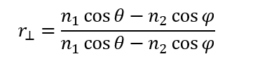
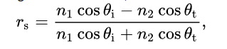
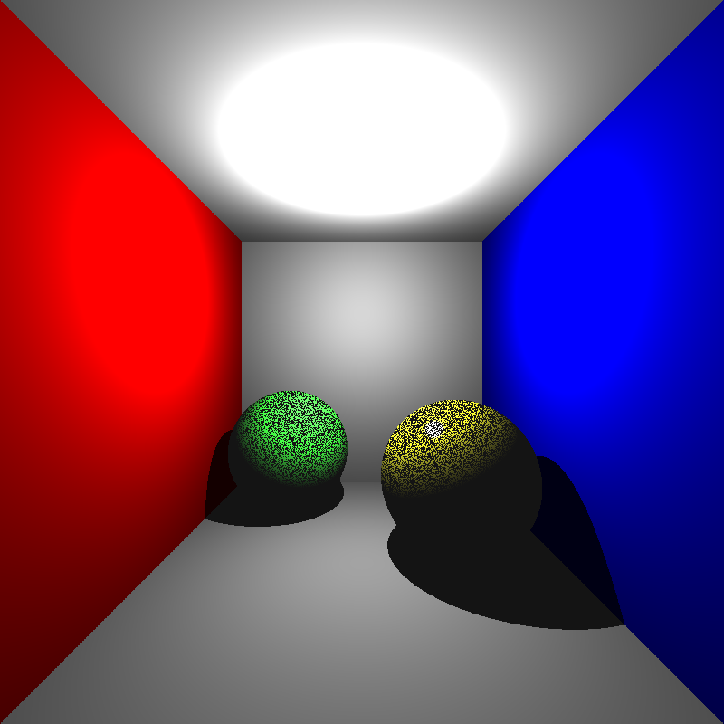
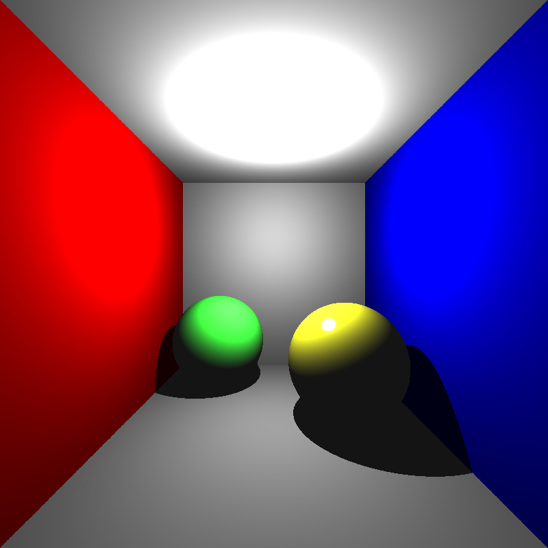
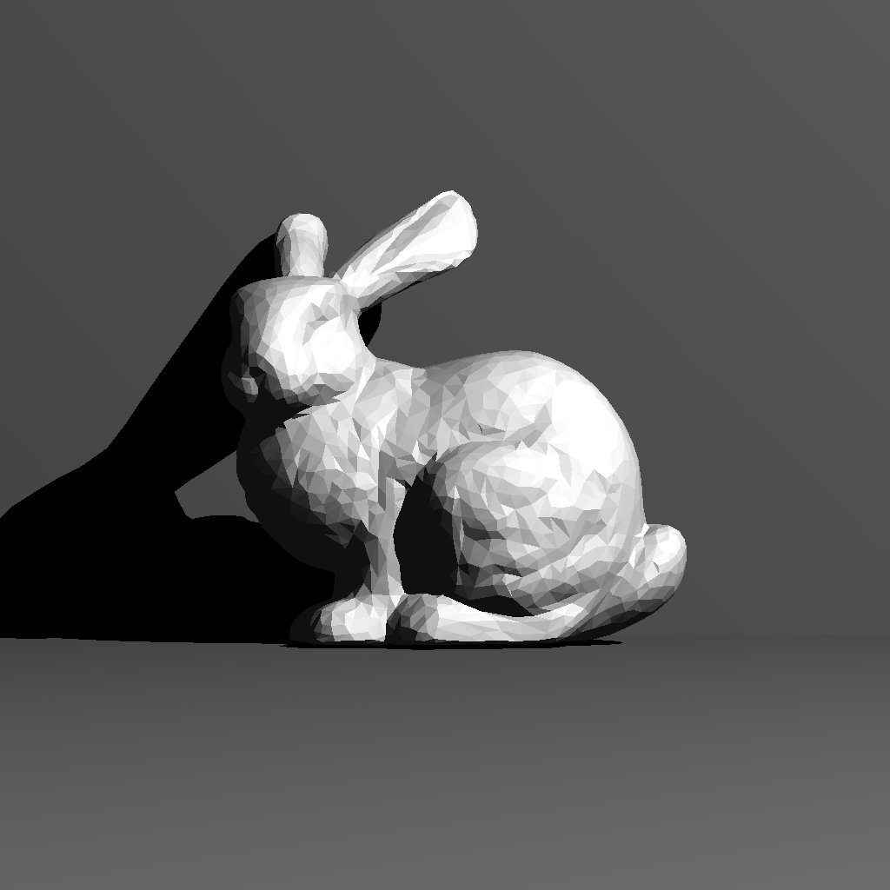
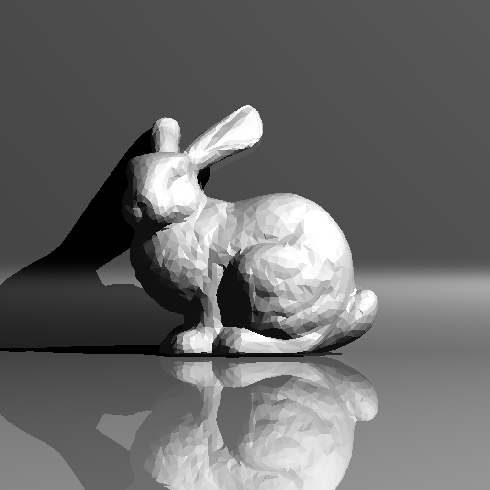
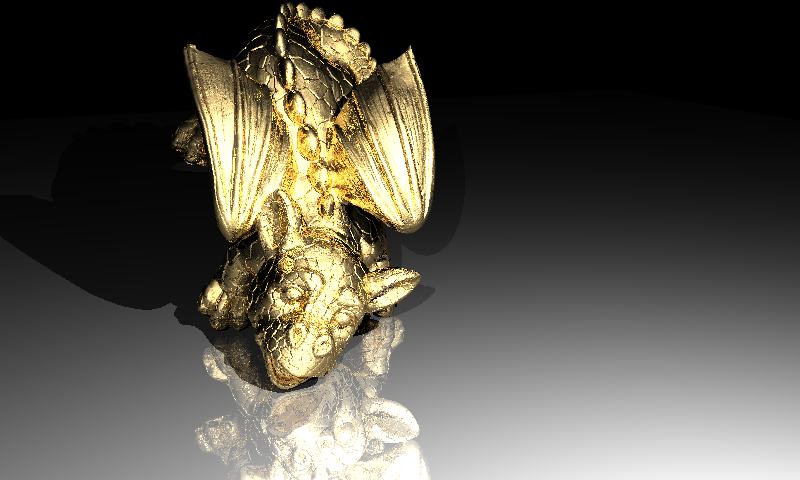
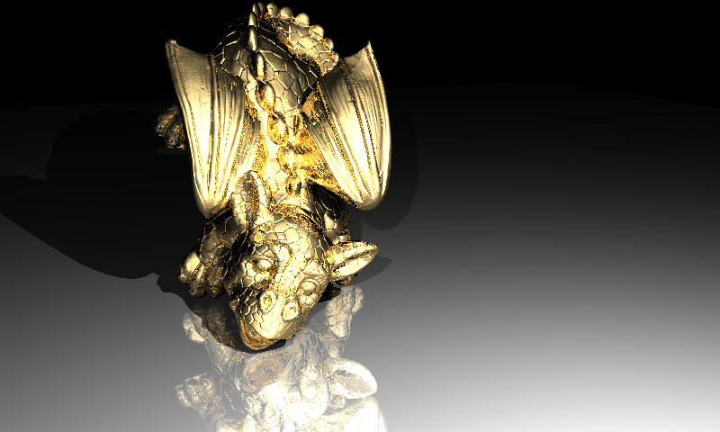

# Ray Tracer Phase 1 Blog

This blog post is about the first ppahse of the CENG795 ray tracer project. As this is the 1st phase, it is just the foundation of the project: a basic ray tracer with no extra features. However, even if it is the 2nd phase's concern, I added the BVH. The reason is that, I did not want to put myself under the burden of changing my architecture for an acceleration structure. Second and most importantly, the acceleration BVH provides make the rendering mush faster; hence, making debugging much faster.

Because of `CENG477` is a prerequisite and we implemented a basic ray tracer, in this blog post I won't be talking about what is the ray tracing and how it is implemented; instead, I will talk about my architecture, the difficulties I came across and a few observations. 

# Project Architecture

In this section, I will provide and briefly explain the architecture. At the beginning, I spent so much time thinking about and designing the architecture as this project will be improved every phase, so I had to design a modular and scalable architecture. Unfortunately, as the remaining time gets shorter, I had to stop thinking about the architecture and dive straight to the implementation. 

```bash
raytracer/
├── camera/
│   ├── camera.cpp
│   └── camera.h
│
├── external/
│   └── json.hpp
│
├── include/
│   ├── aabb.h
│   ├── bvh.h
│   ├── color.h
│   ├── hittable.h
│   ├── interval.h
│   ├── parser.hpp
│   ├── ray.h
│   └── vec3.h
│
├── io/
│   └── stb_image_write.h
│
├── light/
│   └── light.h
│
├── material/
│   ├── material_manager.cpp
│   ├── material_manager.h
│   ├── material.cpp
│   └── material.h
│
├── objects/
│   ├── plane.cpp
│   ├── plane.h
│   ├── sphere.cpp
│   ├── sphere.h
│   └── triangle.h
│
├── render/
│   ├── base_ray_tracer.cpp
│   ├── base_ray_tracer.h
│   ├── render_manager.cpp
│   ├── render_manager.h
│   └── rendering_technique.h
│
├── scene/
│   ├── scene.cpp
│   └── scene.h
│
├── src/
│   ├── aabb.cpp
│   ├── bvh.cpp
│   ├── main.cpp
│   ├── parser.cpp
│   └── ray.cpp
│
└── Makefile
```

## Camera
`class Camera`'s responsibility is creating rays, passing these to the `RenderingTechnique` which actually traces and does the shading, and then writing it back to the `image` buffer. The technique and output buffer are provided by `RenderManager`.

```cpp
class Camera {
public:
	int id;
	std::string image_name;
	Camera();
	Camera(const Camera_& cam);
	~Camera();
	void render(IN const BaseRayTracer& rendering_technique,		
							OUT std::vector<std::vector<Color>>& image) const;

private:	
	Vec3 position, gaze, up;
	double near_plane[4]; // l, r, b, t
	double near_distance;
	int image_width, image_height;
	Vec3 w, u, v, q, su, sv, m;
};
```


## AABB
Header only Axis Aligned Bounding Box. Used for BVH acceleration. Resides as a member of `Hittable` derived classes

```cpp
class AABB {
public:
    Interval x, y, z;

    AABB();
    AABB(const Vec3& p1, const Vec3& p2);
    AABB(const AABB& box1, const AABB& box2);

    const void thicken();
    const Interval& axis(int i) const;
    bool hit(const Ray& ray, Interval ray_t) const;
    const Interval& operator[](int axis) const;
};
```


## BvhNode
Bounding Volume Hierarchy. Responsible for creation of the nodes and the tree. Skyrockets the rendering.

```cpp
class BvhNode : public Hittable{
public:
	BvhNode();
  BvhNode(std::vector<std::shared_ptr<Hittable>>& objects, int begin, int end);

  bool hit(const Ray& ray, Interval ray_t, HitRecord& rec) const override;

  AABB getAABB() const override;

private:
    std::shared_ptr<Hittable> left;
    std::shared_ptr<Hittable> right;
    AABB bounding_box;
};
```

## Color
Header only simple container for RGB color. Contains utility functions and operator overloads.

```cpp
class Color {
public:
  double r, g, b;

  Color() : r(0), g(0), b(0) {}
  Color(double _r, double _g, double _b) : r(_r), g(_g), b(_b) {}
  Color(const Color& other);

  Color(const Vec3& vec);

  Color clamp();

  inline Color operator*=(const Color& other);

  inline Color operator+=(const Color& other);

  inline Color operator+(const Color& c) const;

  inline Color operator-(const Color& c) const;

  inline Color operator*(const Color& c) const;

  inline Color operator*(double s) const;
};
```

## Hittable
Pure virtual base class for world `Triangle`, `Sphere` and `BvhNode`. 

```cpp
class Hittable {
public:
  virtual ~Hittable() = default;
  virtual bool hit(const Ray& ray, Interval ray_t, HitRecord& rec) const = 0;
  virtual AABB getAABB() const = 0;
};
```
The `hit()` method is meant to be return whether is hit, while updating the `HitRecord` in case of success.

## Interval
Header only utility class.

```cpp
class Interval {
public:
    double min, max;

    Interval() : min(INFINITY), max(-INFINITY) {};
    Interval(double _min, double _max) : min(_min), max(_max) {}
    Interval(Interval _i0, Interval _i1) : min(std::min(_i0.min, _i1.min)), max(std::max(_i0.max, _i1.max)) {}

    const void thicken() { min = min - 0.0001f; max = max + 0.0001f; }
    inline Interval merge(const Interval& _other) const { return Interval(std::min(min, _other.min), std::min(max, _other.max)); }
    inline bool overlap(const Interval& _other) const { return (min <= _other.max && _other.min <= max); }
    inline bool consists(const double& point) const { return (min <= point && max >= point); }
    inline double getLength() const { return max - min; }
};
```

## Ray
Simple ray container.

```cpp
class Ray {
public:
    Vec3 origin;
    Vec3 direction;
    Ray();
    ~Ray();
    Ray(const Vec3& _origin, const Vec3& _direction);
};
```

## Vec3
Header only Vec3 vector class consisting utility functions and useful operators.

## LightSources
Struct to hold lighting information.`

```cpp
typedef struct PointLight {
	int id;
	Vec3 position;
	Color intensity;
}PointLight;

typedef struct LightSources {
	std::vector<PointLight> point_lights;
	Color ambient_light;
}LightSources;
```

## Material
Simple container to hold material attributes.

```cpp
class Material {
public:
	Material();
	Material(const Material_& _material);
	int id;
	std::string type;
	Vec3 ambient_reflectance;
	Vec3 diffuse_reflectance;
	Vec3 specular_reflectance;
	Vec3 mirror_reflectance;
	float phong_exponent;
	float refraction_index;
	Vec3 absorption_coefficient;
	float absorption_index;
};
```

## MaterialManager
Responsible for holding the material data, and fetch the data on demand.

```cpp
class MaterialManager {
public:
	MaterialManager() = default;
	MaterialManager(const std::vector<Material_>& materials);
	~MaterialManager() = default;
	const Material& getMaterialById(int id) const;
private:
	std::vector<Material> material_list;
};
```

## Triangle
Triangle derived from `Hittable`. At first, it had basic data like vertices, bounding box and normal. Because of the smooth shading, per vertex normals and a boolean need to be added.

```cpp
class Triangle : public Hittable {
public:

	Triangle(Vec3 _indices[3], int _material_id);
	Triangle(Vec3 _indices[3], int _material_id, Vec3 _per_vertex_normals[3]);
	bool hit(const Ray& ray, Interval ray_t, HitRecord& rec) const override;
	AABB getAABB() const override;

private:
	Vec3 normal;
	Vec3 indices[3];
	AABB bounding_box;
	int material_id;
	bool smooth_shading = false;
	Vec3 per_vertex_normals[3];

	inline double det(const Vec3& c0, const Vec3& c1, const Vec3& c2) const;
	inline Vec3 barycentricCoefficients(const Vec3& point) const;

};
```


## Sphere 
Sphere derived from `Hittable`.

```cpp
class Sphere : public Hittable {
public:
	Vec3 center;
	double radius;
	int material_id;

	Sphere(Vec3 _center, double _radius, int _material_id)
		: center(_center), radius(_radius), material_id(_material_id);
	bool hit(const Ray& ray, Interval ray_t, HitRecord& rec) const override;
	AABB getAABB() const override;

private:
	AABB bounding_box;
};
```

## Plane
A brand new primitive. This is not a `Hittable` as it is unbounded and cannot have an `AABB` that can be used in `BVH` structure.

```cpp
class Plane {
public:
	Plane();
	Plane(const Plane_& _plane, const std::vector<Vec3f_>& _vertex_data);
	bool hit(const Ray& ray, const Interval& interval, HitRecord& rec) const;
	int id;
	int material_id;
	Vec3 point;
	Vec3 normal;
};
```

## Rendering Technique
A pure virtual base class. Provides a common interface for different rendering techniques. When I was designing this, I though maybe in the future I needed to implement different renderers like `PBR` or `Path Tracing`.

```cpp
class RenderingTechnique {
public:
	RenderingTechnique() = default;
	virtual ~RenderingTechnique() = default;
	virtual Color traceRay(const Ray& ray) const = 0;
};
```

## Base Ray Tracer
The main ray tracer class doing the actual job.

```cpp
class BaseRayTracer : public RenderingTechnique {
public:
	BaseRayTracer( Color& background_color,
		LightSources& light_sources,
		BvhNode& world,
		std::vector<Plane>& planes,
		MaterialManager& material_manager,
		RendererInfo& renderer_info);

	Color traceRay(const Ray& ray) const override;

	Color computeColor(const Ray& ray, int depth) const;

	Color applyShading(const Ray& ray, int depth, HitRecord& rec) const;

	bool hitPlanes(const Ray& ray, Interval ray_t, HitRecord& rec) const;

	Color& background_color;
	LightSources& light_sources;
	BvhNode& world;
	std::vector<Plane>& planes;
	MaterialManager& material_manager;
	RendererInfo& renderer_info;
};
```

## Render Manager
`RenderManager` is responsible for apply the given `RenderingTechnique` to the `Scene` with the material info provided by `MaterialManager`. The `render()` method calls the `Camera::render()` for all `Camera`'s in the `Scene`. This method passes an image buffer to the `Camera::render()` as a reference and `Camera::render()` populates the buffer. Finally, the 

```cpp
class RenderManager {
public:
  RenderManager(const Scene& _scene,
    const MaterialManager& _material_manager,
    const RendererInfo _renderer_info,
    const BaseRayTracer& _rendering_technique);
    void render() const;

private:
  void saveImage(const std::string& outputDir, const std::string& fileName, std::vector<std::vector<Color>>& image)
    const;

  const Scene& scene;
  const MaterialManager& material_manager;
  const RendererInfo renderer_info;
	const BaseRayTracer& technique;
  
};
```

# Difficulties
Except the `dielectric` material, other shading computations was very straight forward. First, I wrote my equations exactly according to the lecture slides, but I couldn't get the desired output image. After a few tries I gave up and asked ChatGPT to debug my `dielectric` shading computations and it said my fresnel equations was wrong. According to it, there was a sign error in the denominator of `r_perpendicular`. The formula in the slides:


<p align="center">
  <figure style="display:inline-block; text-align:center; margin:10px;">
    
    <figcaption>In slides</figcaption>
  </figure>
  <figure style="display:inline-block; text-align:center; margin:10px;">
    
    <figcaption>In wikipedia</figcaption>
  </figure>
</p>

As I got the correct image with the second result, i stick with it.

Another difficulty I came across is `parser`. When writing it, if a field which is stated in the pdf is not given I set their values as `default = 0.0`. I assumed the fields like `ShadowRayEpsilon` or `MaxRecursionDepth` is present in all input files but in some files they were missing. For example, in `cornellbox` there were no `ShadowRayEpsilon` or `IntersectionTestEpsilon`. As the `default = 0.0`, the resulting image had black dots on spheres. I set `default = 1e-6`.


<div style="display: flex; justify-content: center; gap: 20px; align-items: flex-start;">
  <figure style="text-align: center; margin: 0;">
    
    <figcaption>epsilon = 0</figcaption>
  </figure>
  <figure style="text-align: center; margin: 0;">
    
    <figcaption>epsilon = 1e-6</figcaption>
  </figure>
</div>


In `bunny` and `bunny_with_plane` there were no `MaxRecursionDepth`. `bunny` had no problem as the scene did not have any mirrors so I did not recognized that then, but when I implemented the `plane` and `mirror` material I noticed that there was a problem. At first glance, I thought I made a mistake in there two but it turned out the `bunny_with_plane.json` was root of the problem. I set `default = 6`.

<div style="display: flex; justify-content: center; gap: 20px; align-items: flex-start;">
  <figure style="text-align: center; margin: 0;">
    
    <figcaption>depth = 0</figcaption>
  </figure>
  <figure style="text-align: center; margin: 0;">
    
    <figcaption>depth = 6</figcaption>
  </figure>
</div>

# Observations
I am not sure whether I did something wrong or really noticed something, but it seems that `other_dragon`'s output image is rendered in `smooth` shading mode. My initial image was a bit noisy in the wings and it was not smooth looking like the provided output. I tried to render it with `smooth` mode by changing the input and I got the exact same image as the desired output. 

Flat:



Smooth:



# Results
The time measurement unit is seconds. 

INEK Machines Single Thread Benchmark:

bunny: 1.72

scienceTree: 6.48

spheres_with_plane: 1.09

cornellbox: 3.79

bunny_with_plane: 16.61

cornellbox_recursive: 5.22

spheres: 2.00

scienceTree_glass: 19.63

two_spheres: 0.32

other_dragon: 36.13

simple: 0.67

spheres_mirror: 1.94

chinese_dragon: 19.53

lobster: 334.5

raven: 24.64

David: 26.56

UtahTeapotMugCENG: 23.48

windmill_smooth: 36.58

low_poly_scene_smooth: 32.04

berserker_smooth: 7.89

trex_smooth: 64.31

tower_smooth: 49.33

Car_smooth and Car_front_smooth: 39.02

ton_Roosendaal_smooth: 34.99
