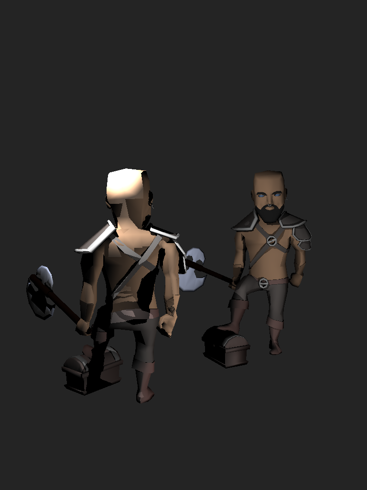
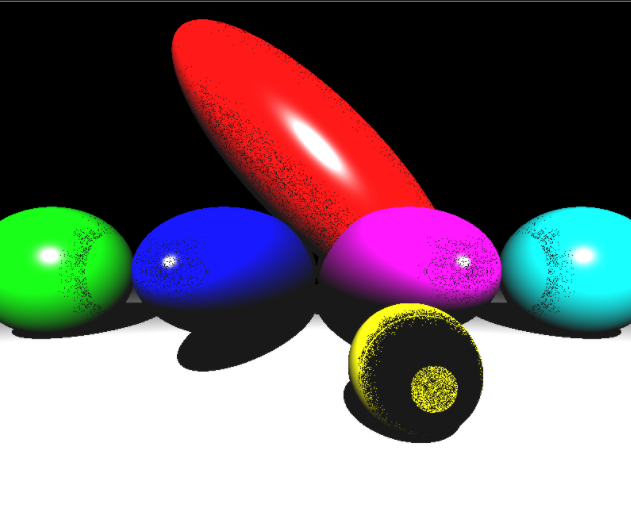
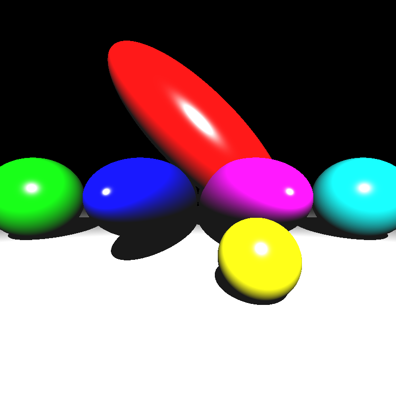
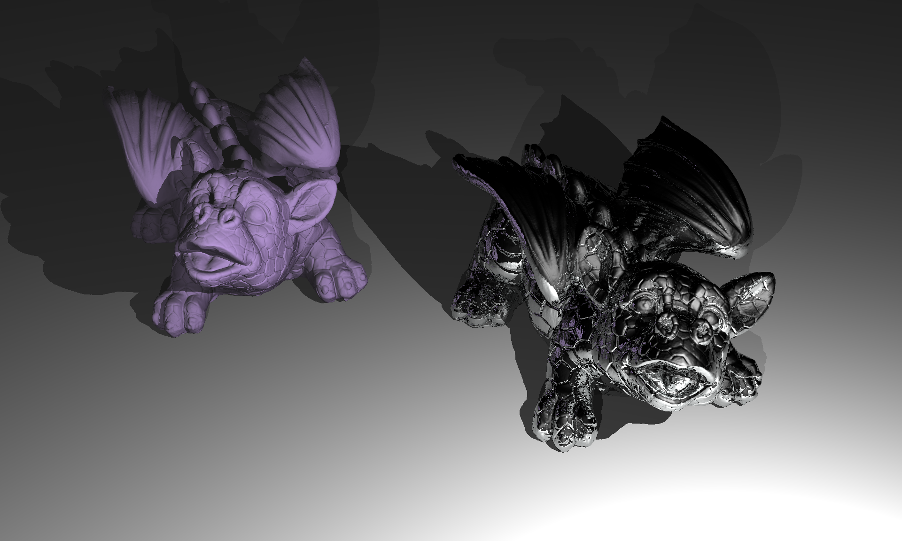
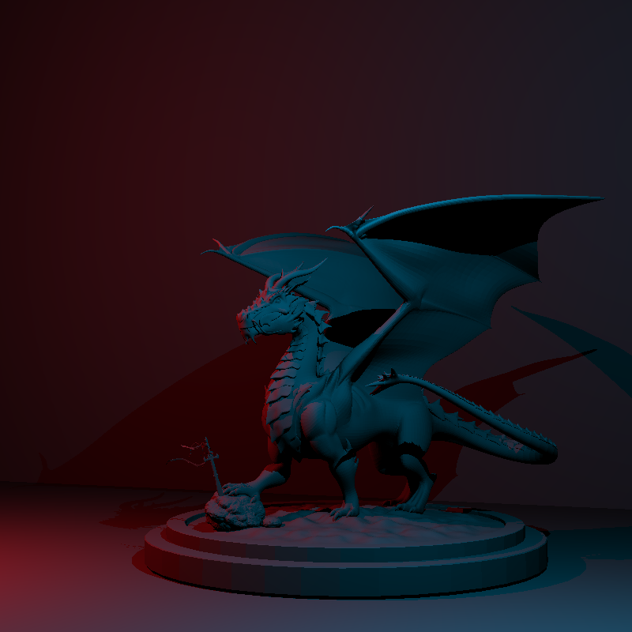
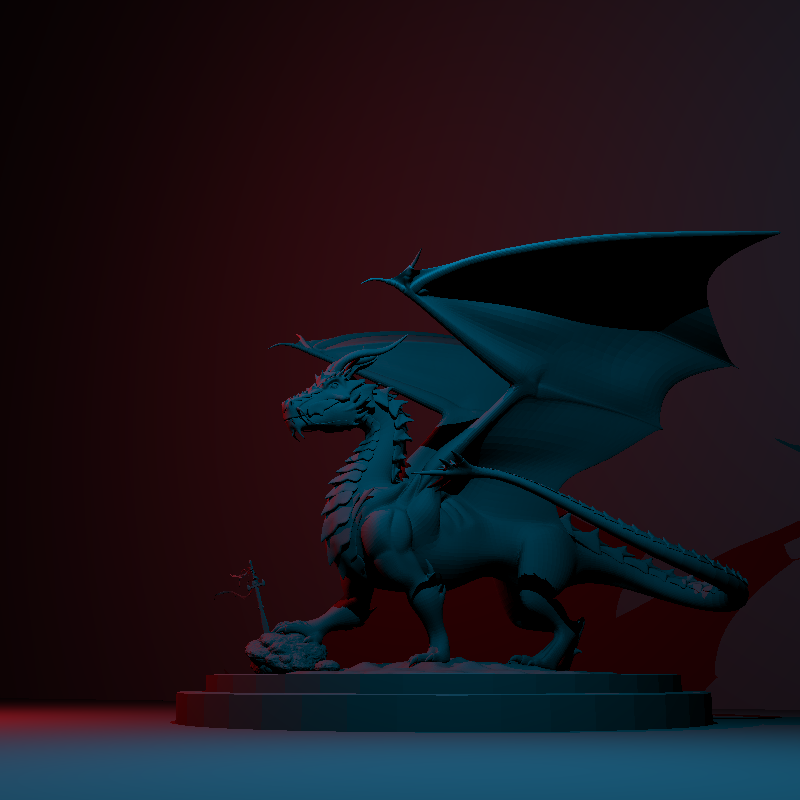
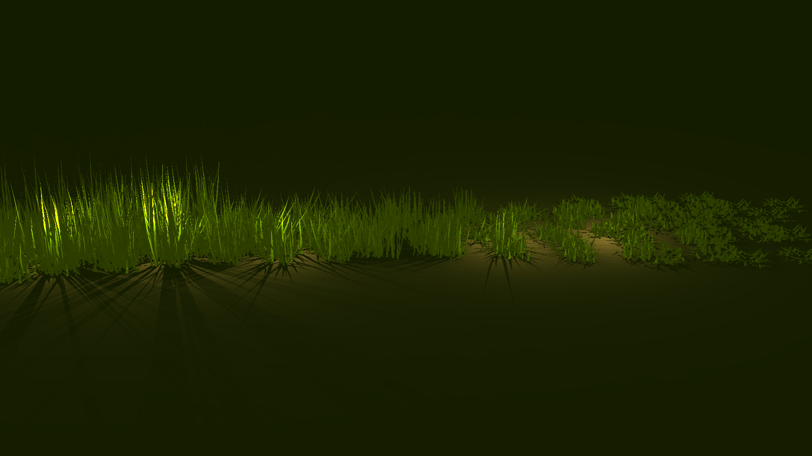
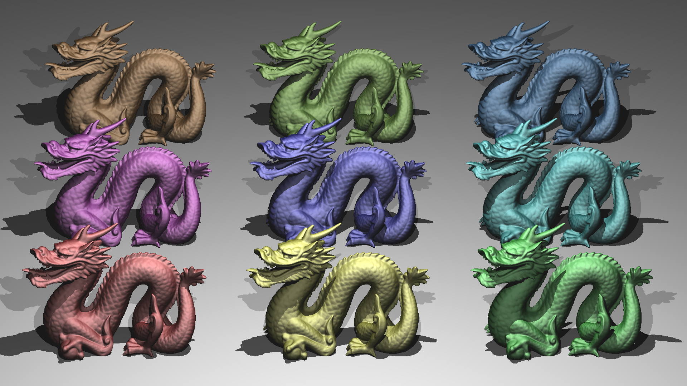
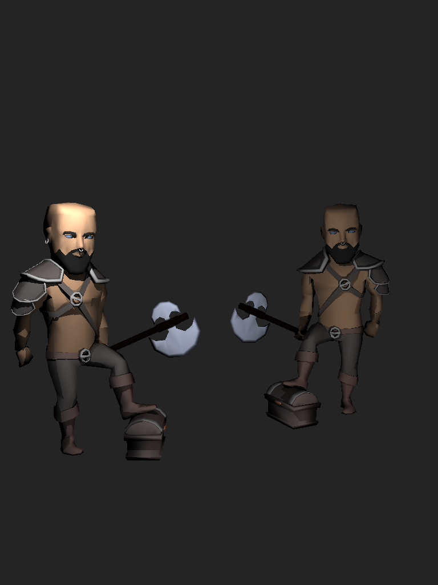

# Ray Tracer Phase 2 Blog

## Architecture and Design
In the previous phase's blog post, I mentioned that I spent time and effort on software architecture and design. Due to the last week was the midterms week, this phase I could not care about my design and I went straight into the implementation. If you were to review the code and criticise me, I beg you to have some mercy as the resulting software isn't the one I truly desired. Before the phase 3, I aim to clean my codebase, redesign it and move forward with a less smelly design. 

## Back-face Culling
Because of the problems mentioned in the above section, I skip to implement the back-face culling. The current implementation depens on a filed named `front_face` in the `HitRecord` to determine whether the ray hit is in the object. As you can infer, this piece of information is used to shade the `dielectric` materials. For the back-face culling, a simple check is enough but it would completely break the `dielectric` shading. Rearranging of `ray`, `HitRecord`, or `Material` is needed; hence, I postponed the back-face culling after the redesign.

## BVH
As mentioned in the previous blog post, the BVH Acceleration is already implemented. For this reason, I am sorry to state that I cannot give a speed comparison between BVH and non-BVH. In the BVH, no surface heuristic is used. The division axis is chosen randomly for every iteration. The reason I didn't implement any surface heuristic is the same with back-face culling. 

## Multi-threading
Multi-threading is added to speed up the rendering. Easy to implement, but highly effective. It is done just by wrapping a for-loop around the main ray-casting loop. 

```cpp
const int numThreads = std::thread::hardware_concurrency();
	std::vector<std::thread> threads(numThreads);
	for (int threadId = 0; threadId < numThreads; threadId++)
	{
		threads[threadId] = std::thread([this, threadId, numThreads, 
			&rendering_technique, &image]() {
			for (int i = threadId; i < image_height; i+=numThreads)
			{
				for (int j = 0; j < image_width; ++j)
				{
					Vec3 pixel_center = q + su * (j + 0.5) + sv * (i + 0.5);
					Ray primary_ray(position, (pixel_center - position).normalize());
					Color pixel_color = rendering_technique.traceRay(primary_ray);
					pixel_color = pixel_color.clamp();
					image[i][j] = pixel_color;
				}
			}
		});
	}
	for (int threadId = 0; threadId < numThreads; ++threadId)
	{
		threads[threadId].join();
	}
```

## The Big Muscular Back of Berserker
Have you ever see the big muscular back of the berserker? I think none of the CENG477 students and most of the CENG795 students haven't see the back of the berserker as it was not requested. So how did I manage to see it?

Story Time: The Man Who Did Not Know About the Library Yet Used It Anyway

In this phase, a certain clueless and unwise man confidently marched into the realm of transformations armed with glm::rotate, glm::scale, and glm::translate, blissfully unaware that glm performs post-order multiplication. At the same time, in a bold display of misplaced certainty, he applied his own matrices using pre-order multiplication. This unholy combination summoned a scene containing two berserkers—one normal, and the other inexplicably twisting his entire torso backward as if proudly presenting his enormous back to some imaginary jury. For a moment, the man believed he had discovered hidden berserker anatomy, before realizing he had simply been defeated by matrix order.



Disclaimer: Don't be this guy, be a good boy and refer to the documentation before you make an attempt to use an external library/framework. 

## Acne Wars 2: Epsilon Strikes Back

In some input files (I noticed this when rendering ellipsoids), `shadowRayEpsilon` or `intersectionTestEpsilon` may have not be given. If you haven't set them to a default value (like this very clever guy writing this blog post), acnes on the scene would even be far worse than on a 15 y.o teenager. 



After adding default values, it got fixed. 

<p align="center">
  
</p>


<p align="center">
  
</p>

## Mirror Room: Unfixed Bug
For some reason, in the mirror room I got images consisting extra degenerate lights and an unnecessary shadow on spheres. Some of our friends suggested that it could be about an epsilon problem related to the interaction between `shadowRay`s and `plane`s. I tried to fix it but I couldn't.

<p align="center">
  
</p>

## Timings

INEK Machines Benchmark

| Scene | Single-threaded (s) | Multi-threaded (s) | Speedup |
|-------|-------------------|------------------|---------|
| mirror_room | 1.43437 | 0.497579 | 2.88x |
| metal_glass_plates | 3.75481 | 1.20459 | 3.12x |
| spheres | 0.343965 | 0.143216 | 2.40x |
| marching_dragons | 68.0822 | 19.7435 | 3.45x |
| simple_transform | 0.120012 | 0.0687059 | 1.75x |
| dragon_metal | 85.2622 | 26.7698 | 3.19x |
| ellipsoids | 0.585339 | 0.201448 | 2.91x |
| grass_desert | 413.989 | 136.034 | 3.05x |
| glaring_davids | 6.60026 | 2.05733 | 3.21x |
| dragon_new_top_ply | 6.83121 | 1.97445 | 3.46x |
| dragon_new_ply | 5.97852 | 1.80074 | 3.32x |
| dragon_new_right_ply | 6.11836 | 1.80343 | 3.39x |
| two_berserkers | 1.4746 | 0.533491 | 2.76x |


## Results
### Dragon Metal


### Dragon New


### Dragon New Right


### Grass Desert


### Marching Dragons


### Metal Glass Plates


### Two Berserkers


### Davids Camera Zoom


### Davids Light Around


### Davids Camera Around


