# Ray Tracer Phase 3 Blog

## Architecture & Design
Just as I said in the previous blog post, I did some changes in the implementations. The first major change is the addition of `TLASBox`, and `Mesh` classes together with the removal of `HittableInstance`, `MeshInstance`, and `BaseMesh` classes. The previous design was just a garbage amalgamation of code-duplication and poorly designed interfaces caused by rushing and monkey-patching. 

`HittableInstance` (for spheres and triangles), and `MeshInstance` (for meshes) were for the TLAS bounding boxes. These two are now combined into the `TLASBox` class. `TLASBox`s used to create the top level `BVH` structure, and redirect the transformed rays to the local space objects. Also, this class is responsible for the fetching the material for the success hits. The `Mesh`, `Triangle`, and `Sphere` are now pure geometric entities, knowing nothing about the material properties. 

Another change I've made while designing the `TLASBox` was removing the data from the objects. Now, they are just accessing the data from an outside resource array with an access index which are supplied to them in their construction. This made the design more data oriented rather than object oriented to become more cache frienly. At least, I made it this way thinking it would be beneficial, but I didn't make a seperate benchmark test just for this excluding the other changes. 

Interface of the `TLASBox`:

```cpp
class TLASBox : public Hittable {
public:
	TLASBox(
		int _local_index,
		int _world_index, 
		const std::vector<std::shared_ptr<Hittable>>& _local_space_objects,
		const std::vector<std::optional<glm::mat4>>& _transform_matrices,
		const std::vector<int>& _material_ids,
		const std::vector<Vec3>& _motion_blur
	);
	const int local_index;
	const int world_index;
	bool hit(const Ray& ray, Interval ray_t, HitRecord& rec) const override;
	AABB getAABB() const override;
private:
	AABB bounding_box;
	const std::vector<std::shared_ptr<Hittable>>& local_space_objects;
	const std::vector<std::optional<glm::mat4>>& transform_matrices;
	const std::vector<int>& material_ids;
	const std::vector<Vec3>& motion_blur;
};
```

As you can see, the `TLASBox` is also a `Hittable`. This is because the `BVH` construction will also be done for `Mesh`s' `Triangle`s. In order to make `BVH` polymorphically work for both of them, I had to made it this way even though I do not like that. And this brings us to my other overarching concern: OOP and inheritance. 

## Inheritance Scepticism
To have more decoupled, more flexible, and faster design it feels like i have to get rid of the virtual inheritance. I want my objects be a hittable object just because they have `hit()` method, and not they have common `hit()` method because they are inherited from the `Hittable` base class. Then, my `BVH` should be able to work all types that have the required methods and data regarding their base class. The virtual inheritance also creates an overhead for the function calls as it needs to look-up to the virtual table to determine the which derived class' overwritten method would be called. Also, keeping arrays of objects shared parent objects enforces the use of pointers which will cause indirect jumps. As an alternative, I am planning to use `std::variant` and `concepts` to implement common interfaces imitating the `rust`s `trait` system. This loads more work on the programmer and result in more repetitive boiler-plate code snippets, but I will try to make it work, making more meta-programming to make it as less repetitive as possible. 

## BVH Linearization
Previous implementation of my `BVH` was basic tree structure which is not cache friendly. To make things faster, I linearized my `BVH` structure. After creating the tree as usual, I converted the tree into an array with bvh nodes where the left child of a node is the right next to the node and the right child is some offset ahead of the parent (primitive count and right child offset are stored in the node). This linear tree nodes are structs aligned at 32 bytes. When traversing, we just do an index-based lookup and with every lookup more cache hits takes place. With this change, I achieved nearly 20 times faster renderings for the previous phase's scenes. 

```cpp
int BVH::buildFlatBVH(TreeBVHNode* node, int& offset)
{
  Expects(node);
  LinearBVHNode* linear_node = &linear_nodes_[offset];
  linear_node->bbox = node->bbox;
  int current_offset = offset++;

  if (node->primitive_count > 0)
  {
    linear_node->primitives_offset = node->primitives_offset;
    linear_node->primitive_count = node->primitive_count;
  }
  else
  {
    linear_node->primitive_count = 0;
    linear_node->axis = node->split_axis;
    buildFlatBVH(node->left, offset);
    linear_node->right_child_offset = buildFlatBVH(node->right, offset);
  }
  delete node;
  return current_offset;
}
```

```cpp
bool BVH::intersect(const Ray& ray, Interval ray_t, HitRecord& rec) const
{
  if (linear_nodes_.empty()) 
    return false;

  bool hit_anything = false;
  int current_node_index = 0;

  int stack_ptr = 0;
  int nodes_to_visit[INTERSECTION_STACK_SIZE];

  while (true)
  {
    const LinearBVHNode* node = &linear_nodes_[current_node_index];
    if (node->bbox.hit(ray, ray_t))
    {
      if (node->primitive_count > 0) // Leaf
      {
        for (int i = 0; i < node->primitive_count; i++)
        {
          if (primitives_[node->primitives_offset + i]->hit(ray, ray_t, rec))
          {
            hit_anything = true;
            ray_t.max = rec.t;
          }
        }
        if (stack_ptr == 0) break;
        current_node_index = nodes_to_visit[--stack_ptr];
      }
      else // Inner
      {
        bool dir_is_neg = ray.direction[node->axis] < 0;

        int near_index, far_index;

        if (dir_is_neg)
        {
          near_index = node->right_child_offset;
          far_index = current_node_index + 1;
        }
        else
        {
          near_index = current_node_index + 1;
          far_index = node->right_child_offset;
        }

        nodes_to_visit[stack_ptr++] = far_index;
        current_node_index = near_index;
      }
    }
    else // Missed Box
    {
      if (stack_ptr == 0) 
        break;
      current_node_index = nodes_to_visit[--stack_ptr];
    }
  }
  return hit_anything;
}
```

## my_random
This is a helper source file I created for generating samples. As recommended, I used jittered sampling. 

The pitfall that one might catch is the usage of `std::mt19937 gRandomGenerator`. If not initialized with a setup like `static thread_local std::mt19937 generator(std::random_device{}());`, every generation call will end up in the same value as the seed never changes. (don't ask how I know). 

You might think that constructing and calling in a function will make it cleaned after the function call and when a new function call happens, it will be a fresh new generator, but that was not the case. The seed stays the same for the program lifetime, everytime it reconstructed, it came to life with the same seed. Constructing it with the `std::random_device{}()` fixes the seed; however, without `static`, for every call, there will be a new initialization and this would end up in big overhead. Without `thread_local`, every thread would try to access the same generater and this could have caused data races, for thread-safety, this is also needed.

```cpp
float generateRandomFloat(float start, float end)
{
  static thread_local std::mt19937 generator(std::random_device{}());
  std::uniform_real_distribution<float> distribution(start, end);
  return distribution(generator);
}

std::vector<float> generateNRandomFloats(float start, float end, float N)
{
  std::vector<float> result(N);
  for (int i = 0; i < N; i++)
  {
    result.push_back(generateRandomFloat(start, end));
  }
  return result;
}

std::vector<std::pair<float, float>> generateJitteredSamples(int num_samples)
{
  Expects(num_samples > 0);
  int n = std::sqrt(num_samples);
  Expects(n * n == num_samples);
  std::vector<std::pair<float, float>> samples(num_samples);
  int i = 0;
  for (int y = 0; y < n; y ++)
  {
    for (int x = 0; x < n; x++)
    {
      float psi1 = generateRandomFloat(0, 1);
      float psi2 = generateRandomFloat(0, 1);
      samples[i].first = (x + psi1) / n;
      samples[i].second = (y + psi2) / n;
      i++;
    }
  }
  return samples;
}
```

In these code snippets, you could notice the `Expects()` method. This method is part of the `gsl` (GuidelineSupportLibrary) header. This is nothing more than a basic check for a specific condition used for preconditions. In case of fail, it generates an error. So here is the question: Why not our old good friend `if()`? It is because I want to distinguish my preconditions from the regular code. This is a check for the programmer/program mistakes, not a check for a desicion. As our instructor mentioned in one of the classes, except being a computer graphics course, this course is also a heavt `c++` (preferably) implementation course. To improve my knowledge and programming, I started to read C++ Core Guidelines by Bjarne Stroustrup, and Herb Sutter. In the mean time, I couldn't find enough time to finish or digest the part I read. However, some of the things stayed in my mind, and stating preconditions explicitly was one of them so I added where I can think of. 

## Cameras, Pixel Sampling, Aperture Sampling
This phase requires our raytracers to support non-pinhole cameras. Now, instead of one camera, I have a `BaseCamera` class and two derived cameras `PinholeCamera`, and `DistributionCamera`. What they have in common besides the obvious shared data fields is `void BaseCamera::generatePixelSamples(int i, int j, std::vector<Vec3>& out_samples) const` method. As the name infers, it fills the provided container with the pixel samples for a given (width, height). 

```cpp
void BaseCamera::generatePixelSamples(int i, int j, std::vector<Vec3>& out_samples) const
{
	std::vector<std::pair<float, float>> samples
		= generateJitteredSamples(num_samples);

	out_samples.clear();

	for (const auto& [x, y] : samples)
	{
		Vec3 pixel_sample = q + su * (j + x) + sv * (i + y);
		out_samples.emplace_back(pixel_sample);
	}
}
```
`DistributionCamera` also has a method for generating aperture samples.

```cpp
void DistributionCamera::generateApertureSamples(
	std::vector<Vec3>& out_samples) const
{
	std::vector<std::pair<float, float>> samples
		= generateJitteredSamples(num_samples);

	out_samples.clear();
	for (const auto& [x, y] : samples)
	{
		Vec3 aperture_sample = position + (u * (x - 0.5f) + v * (y - 0.5f)) * aperture_size;
		out_samples.emplace_back(aperture_sample);
	}
}
```

These samplings took place in the main camera loop for the scene, just before generating the ray and tracing it. 

### Resulting Scenes with Multi-sampling & Lens-sampling Only
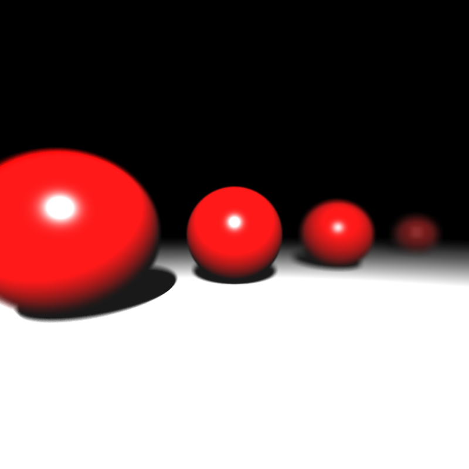
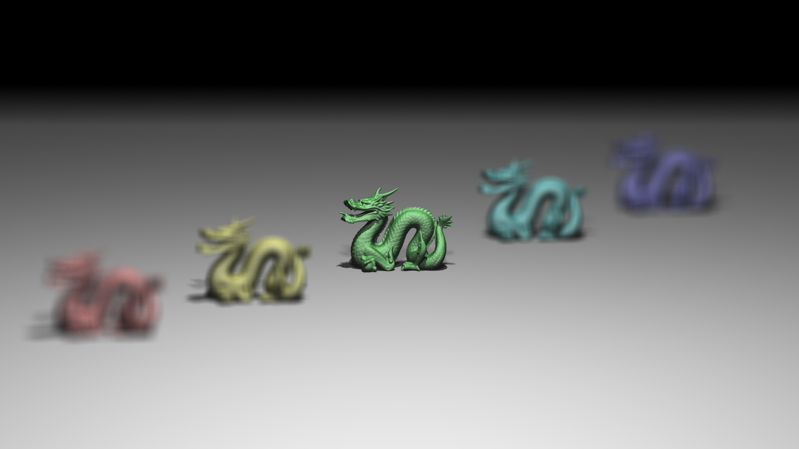

## Area Light Sampling

So far we are good except the area lights and sampling for them. My approach was pregenerating them. I created a 3D vector for `[recursionDepth][areaLightId][samplingIndex]` to sample from area lights.

I populated this vector for every possible depth, and area light in the scene by looping and calling the `areaLight`s generate samples method.

```cpp
struct AreaLight {
	int id;
	Vec3 position;
	Vec3 normal;
	float edge;
	Vec3 radiance;
	Vec3 u, v;
	void generateAreaLightSamples(
		std::vector<Vec3>& out_samples, int num_samples
	) const
	{
		std::vector<std::pair<float, float>> samples
			= generateJitteredSamples(num_samples);

		out_samples.clear();
		for (const auto& [x, y] : samples)
		{
			Vec3 area_light_sample
				= position + (u * (x - 0.5f) + v * (y - 0.5f)) * edge;
			out_samples.emplace_back(area_light_sample);
		}
	}
};
```
Then, I provided this containers pointer and which index to sample by passing an instance of `RenderContext` struct which created for this specific purpose.

```cpp
struct RenderContext {
	const std::vector<std::vector<std::vector<Vec3>>>* area_light_samples;

	int sample_index;
};
```
Also, I had to change my `BaseRayTracer::traceRay`, `BaseRayTracer::computeColor`, and `BaseRayTracer::applyShading` methods to accept the context as a parameter and pass down in order to be used when the shading happens. Down here is the updated main render loop for `DistributionCamera` to support multi-sampling (as there is no aperture sampling for `PinholeCamera`s, the render method of these two are different even though the most part is the same across two). 

```cpp
std::vector<Vec3> pixel_samples;
pixel_samples.reserve(num_samples);

std::vector<Vec3> aperture_samples;
aperture_samples.reserve(num_samples);

std::vector<std::vector<std::vector<Vec3>>> area_light_samples;
area_light_samples.resize(recursion_depth + 1);
for (int l = 0; l < recursion_depth + 1; l++)
{
		area_light_samples[l].resize(num_area_lights);
		for (int m = 0; m < num_area_lights; m++)
		{
				area_light_samples[l][m].reserve(num_samples);
		}
}

std::mt19937 rng(std::random_device{}());
for (int i = threadId; i < image_height; i += numThreads)
{
    for (int j = 0; j < image_width; ++j)
    {
        Color pixel_color = Color(0.0, 0.0, 0.0);
        generatePixelSamples(i, j, pixel_samples);
        generateApertureSamples(aperture_samples);
        std::shuffle(aperture_samples.begin(), aperture_samples.end(), rng);

        for (auto& depth : area_light_samples)
        {
                for (int f = 0; f < num_area_lights; f++)
                {
                    area_lights[f].generateAreaLightSamples(depth[f], num_samples);
                    std::shuffle(depth[f].begin(), depth[f].end(), rng);
                }
        }

        for (int k = 0; k < num_samples; k++)
        {
                Vec3 a = (aperture_size > 0.0) ? aperture_samples[k] : position;
                Vec3 dir = calculateDir(pixel_samples[k], a).normalize();

                Ray primary_ray(a, dir, generateRandomFloat(0, 1));

                RenderContext context;
                context.area_light_samples = &area_light_samples;
                context.sample_index = k;
                pixel_color += rendering_technique.traceRay(primary_ray, context);
        }
        pixel_color = pixel_color / (float)num_samples;
        pixel_color = pixel_color.clamp();
        image[i][j] = pixel_color;
    }
}
```

### A Bug Overview For My Future 795 Comrades
If you are reading this blog post to find a solution to a bug by looking the past years' blogposts and hoping to find someone mentioning the same problem with its solution, maybe this is the thing you have been looking for. 


#### Buggy Outputs

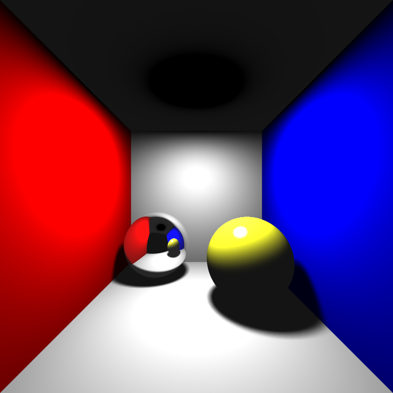

cornellbox_area: The scene shading looks fine except the area light at the ceiling. This is mentioned in the class as the when rendering arealight assumed to be two-sided for the outputs, this was expected at that point.

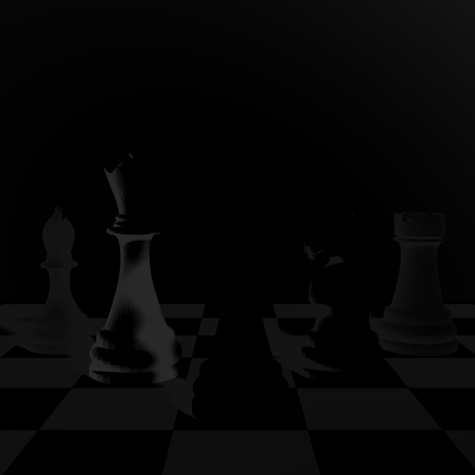
chessboard_arealight: But for this one, the image is too dark compared to the expected output. I didn't notice at first glance, I thought this is caused by something else; however, this one is also not being two-sided problem. 

```cpp
// from BaseRayTracer::applyShading()

for (const auto& light : light_sources.area_lights)
{
    Vec3 light_sample_point = (*context.area_light_samples)[depth - 1][light.id][context.sample_index];
    Vec3 wi = light_sample_point - rec.point;
    double distance = wi.length();
    wi = wi.normalize();
    // some lines of code
    double cos_alpha_light = (wi * -1.0).dot(light.normal);
    // some lines of code
}
```
The line `double cos_alpha_light = (wi * -1.0).dot(light.normal);` results in a negative output when the normal of the area light is facing away from the intersection poing. As a consequence, the contribution is subtracted from the final color instead of added to it. Hence, dark scene. The solution was simple: Taking the absolute value. 

### Resulting Scenes with Area Light

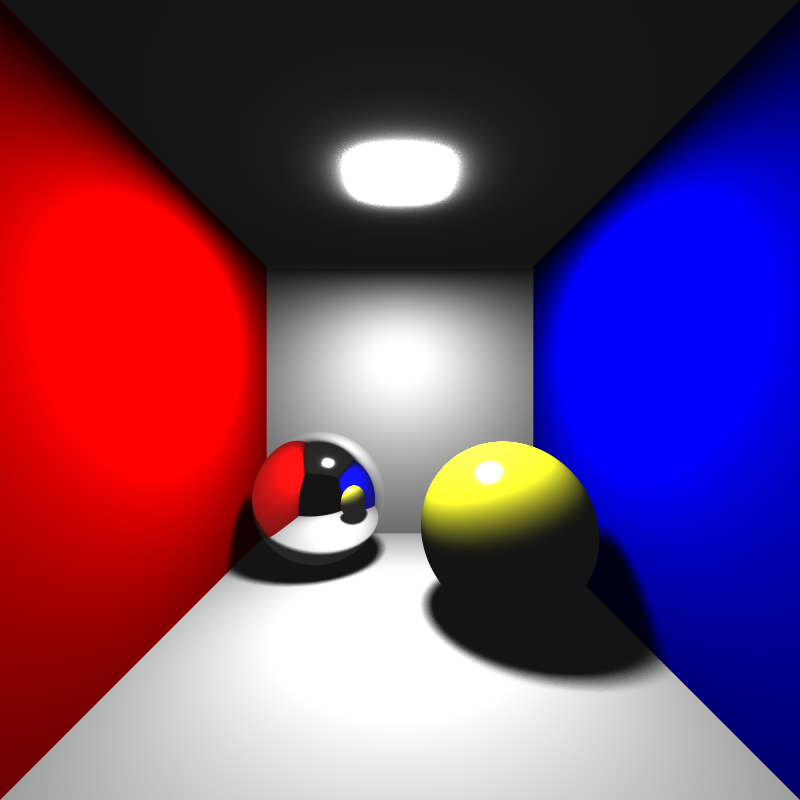
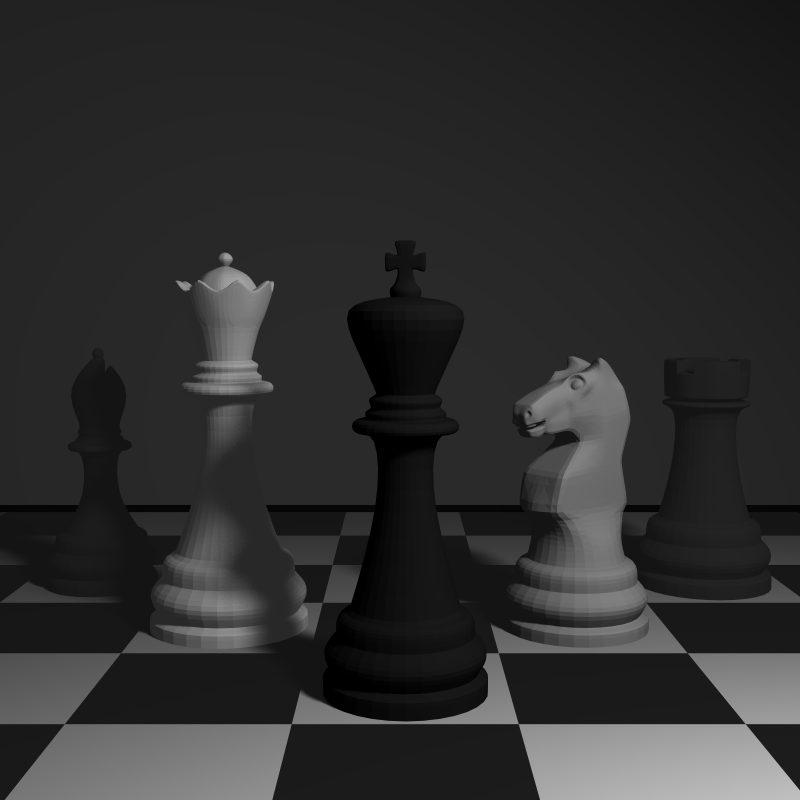

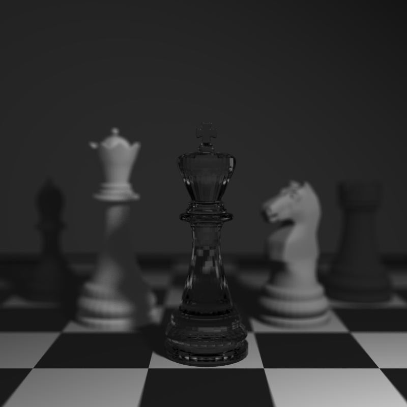
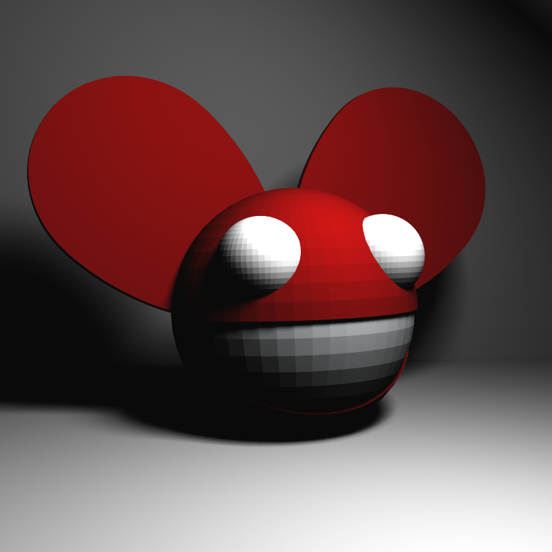
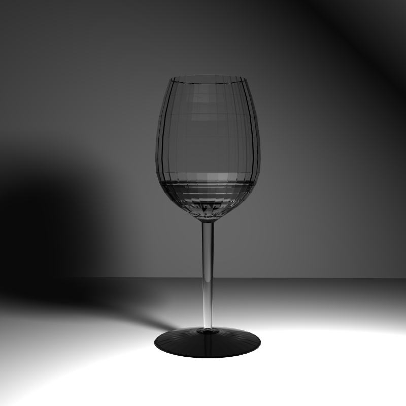


## Glossy Reflections
This feature was one of the easiest one to implement. Calling the `Ray::perturb` was enough when the material type is `Mirror`, `Dielectric`, or `Conductor`. 

```cpp
void Ray::perturb(float roughness)
{
	Vec3 u, v;
	Vec3::createONB(direction, u, v);
	float psi1 = generateRandomFloat(0, 1);
	float psi2 = generateRandomFloat(0, 1);
	//std::cout << psi1 << psi2 << std::endl;
	direction = direction + (u * (psi1 - 0.5) + v * (psi2 - 0.5)) * roughness;
	direction.normalize();
}
```

```cpp
static inline void createONB(const Vec3& r, Vec3& u, Vec3& v)
{
  Vec3 w = r.normalized();

  Vec3 helper = (std::abs(w.x) > 0.9f)
    ? Vec3(0.0f, 1.0f, 0.0f)
    : Vec3(1.0f, 0.0f, 0.0f);

  u = (helper.cross(w)).normalized();

  v = w.cross(u);
}
```

### Resulting Scenes with Glossy Reflections
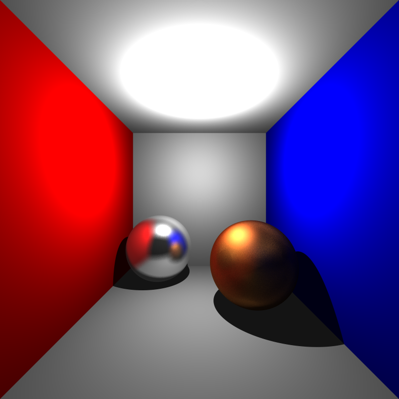
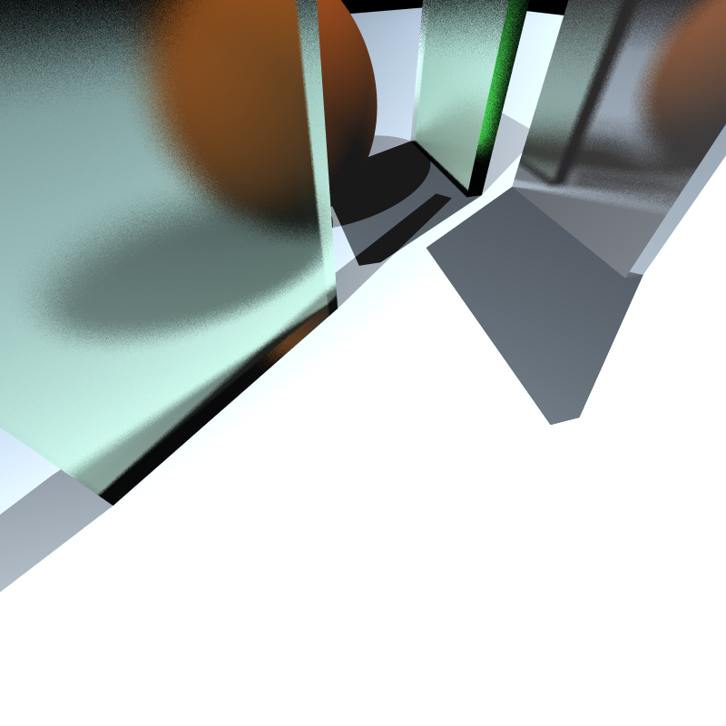

## Motion Blur
To begin with, our rays need to have a time parameter. I added this as a member variable to the `Ray` class. Then, generated the primary rays like this: `Ray primary_ray(position, dir, generateRandomFloat(0, 1));`. Also, reflected, refracted and shadow rays directly inherited this time parameter by being constructed with the predecessor ray's `time`. 

Then, bounding boxes in the top level need to be adjusted. This box is a big box that covers for the object's entire possible position between `t=0`, and `t=1` inclusive. 

```cpp
// in TLASBox::TLASBox(args...)
Vec3 motion_blur = this->motion_blur[world_index];
glm::mat4 identity = glm::mat4(1.0);
glm::mat4 translate = glm::translate(identity, motion_blur.toGlm3());
AABB t_0_pos = box;
AABB t_1_pos = t_0_pos.transformBox(translate);
box.expand(t_1_pos);
```

Finally, the transformed ray that will be redirected to the local space must be inverse transformed with the object's position with respect to the `ray.time`.

```cpp
motion_offset = motion_blur[world_index] * ray.time; // translational displacement

const Vec3 world_origin = ray.origin - motion_offset; // inverse transforming before the instancing transformation

rec.point = Vec3(world_hit_point) + motion_offset; // recoviring 
```

As you see, I did not created a 4x4 transformation matrix and went to all these matrix multiplications. Translating a ray means just shifting the ray origin. Instead of heavy computations, I can just subtract and add the displacement to the ray's origin. 

### Resulting Scenes with Motion Blur
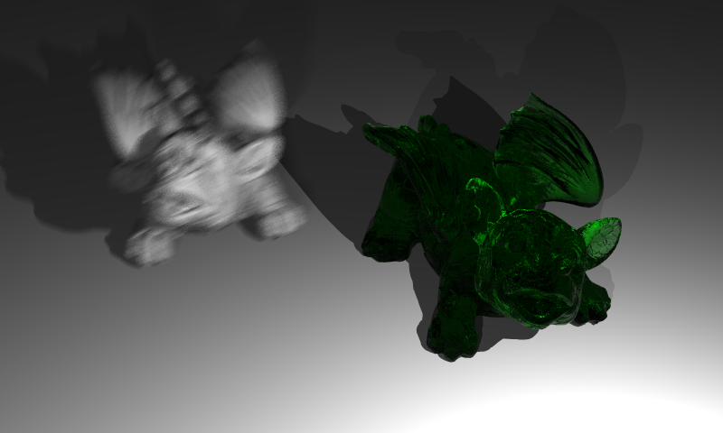

#### Cornellbox Boxes Dynamic

For some reason I couldn't get a correct final image for this scene. I haven't figure out a way to fix this. 


## Tap Water
Hard to see in Ankara these days.

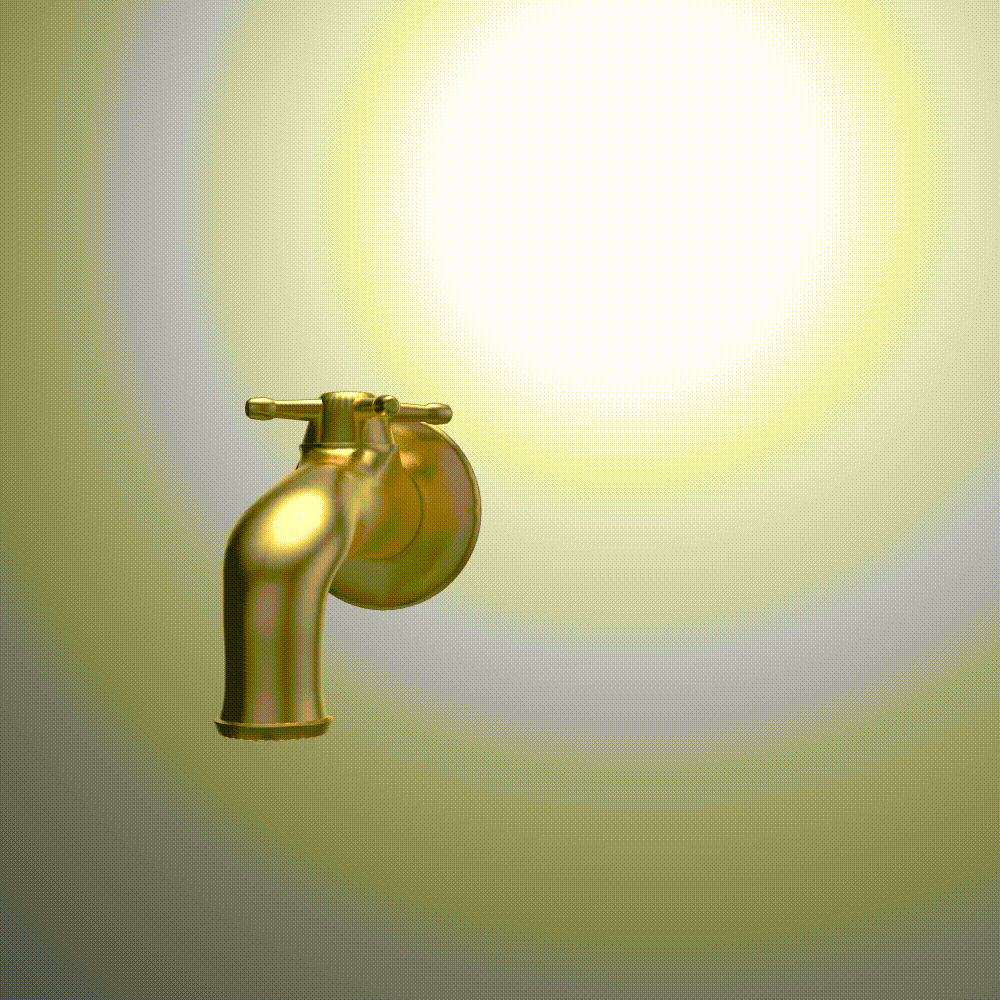


## Benchmarks

Multi-threaded INEK Benchmark

| Scene                                      | Time (s)     |
|--------------------------------------------|--------------|
| cornellbox_boxes_dynamic                   | 35.8978      |
| focusing_dragons                           | 45.1416      |
| spheres_dof                                | 5.31146      |
| dragon_dynamic                             | 104.88       |
| metal_glass_plates                         | 15.594       |
| cornellbox_brushed_metal                   | 22.746       |
| cornellbox_area                            | 7.21568      |
| deadmau5_scene                             | 24.8572      |
| wine_glass_scene                           | 452.365      |
| chessboard_arealight_dof_glass_queen       | 32.952       |
| chessboard_arealight_dof                   | 17.4324      |
| chessboard_arealight                       | 15.5146      |


