# Ray Tracer Phase 4 Blog

## Architecture and Code Design

First of all I realized that I've been going in the wrong direction when it comes to the programming. At the beginning of the semester, I thought going with a object oriented way would be more managable and scalable as the new features are needed, but it turned out it was not the case. With every new feature, it became harder and harder to maintain all this ownerships, classes, access modifications, which data need to be passed or need to be kept as a member variable etc. In every dawn of a new deadline, to finish things in time, I had to monkey-patch more and more. All these SOLID principles, clean coding, classic buzz-word soup software engineering guidlines, OOP worshipping had poisoned my head that I didn't even realize a raytracer is not a good use-case. However, thats why mistakes are there. They are meant to be made, made, made, made, made 50 more times, and take a lesson from them and move on. I need to cleanup all these unneccessary class abstractions and make the codebase more function oriented. I think I might even say I am leaving this "Object Religion". Also I want to drop this banger here:

Losing My Religion
[](https://www.youtube.com/watch?v=OKvCV8MFIaw)


So let's talk about the changes that I made to solve the problems that I shouldn't even need to solve. 

First of all I got rid of `Hittable` pure virtual base class for the scene objects (Triangle, Sphere, Mesh, TLASBox). They still have polymorphic behaviour but not through inheritance, rather with `std::variant`, and `concept`. I did this because I want less indirection. As far as I understood, to virtual dispatch, 2 pointers needed to be resolved. One for the vtable, and one for the target function overload.

In `std::variant`, first a switch case decides which variant member type is used for the function call, and one function pointer resolution. I thought latter would be faster than the first, but I didn't get any benefit from it. Maybe that is because this information is cached and branch predictor works really well. 

In addition, after some research, I saw some benchmarks that virtual dispatch works well better than the variant.visit on average. Even with this, I expected better results as unions are contigiously allocated, which can result in better cache locality. My problem here was thinking in terms of pure benchmark values in isolated cases. The answer was profiling. An approach could work better than other in some use-cases and not in other. My access pattern to the objects are through the top level acceleration structure nodes and they store the actual geometry as pointer. Even though, they are variants, their order in the container vector is not aligned as linear BVH traversal order. I do not get any cache locality value. Anyways, I wanted to give it a try. And this brings to us to my other issue: My laptop. These days it works too slow. Nearly, for all the changes I've done for the optimization I get no benefit. Sometimes, running the same code for twice results in considerably longer rendering time for the second run. After countless change I've made, I tried to  run my code in my friend's laptop and a scene that is rendered for ~110 seconds, rendered in his computer for ~38 seconds, and I cannot clearly say that my changes worked, or his computer is just faster.


Here is the new implementation:

```cpp
template <typename Variant>
struct validate_variant;

template <typename... Ts>
struct validate_variant<std::variant<Ts...>> {
  static_assert((GeometryConcept<Ts> && ...),
                "All types in Geometry::Variant must satisfy GeometryConcept");
};


class Geometry {
public:
	using Variant = std::variant<Triangle, Sphere, Mesh>;

  static validate_variant<Variant> _check;

  template <GeometryConcept T, typename... Args>
  Geometry(std::in_place_type_t<T>, Args&&... args)
    : data(std::in_place_type<T>, std::forward<Args>(args)...)
  {
  }

  bool hit(const Ray& ray, Interval ray_t, HitRecord& rec) const
  {
    return std::visit([&](auto const& obj) -> bool {
      return obj.hit(ray, ray_t, rec);
                      }, data);
  }

  AABB getAABB() const
  {
    return std::visit([&](auto const& obj) -> AABB {
      return obj.getAABB();
                      }, data);
  }

private:
  Variant data;

};

```

The `Geometry` class is just a wrapper to the variant to abstract the C++ boilerplate and provide a clean interface. In the above, you can see the `GeometryConcept`, which is for enforcing the common interface. If one of the variant members do not implement the interface in the desired way, the code won't be compiled. This enforces the programmer to implement the interface.

```cpp
template <typename T>
concept HasHit = requires(const T & obj, const Ray & ray, Interval ray_t, HitRecord & rec)
{
  { obj.hit(ray, ray_t, rec) } -> std::same_as<bool>;
};

template <typename T>
concept HasGetAABB = requires(const T & obj)
{
  { obj.getAABB() } -> std::same_as<AABB>;
};

template <typename T>
concept GeometryConcept = HasHit<T> && HasGetAABB<T>;
```

With concepts, I can enforce specific feature to a specific class. I can couple/decouple whatever feature I want. This helps us to design more flexible interfaces. Now `Hittable` objects are `Hittable` because they have certain methods and data, and not have the certain methods and data because they are derived from the `Hittable`, like mimicing the Rust's trait system. Just as I said, now I don't think that I need flexible interfaces as I don't think that I need that much of an interface now. 

I also tried some template magic with triangles to do checks in the compile time aiming to achieve less branching (which I %95 didn't need as branch predictor does its job well). The problem was this: Some conditions are determined after parsing and won't change in the entire program lifetime. For example; if a triangle/mesh is smooth shaded or textured it will stay as like that all the time. In the previous code, I was making a simple if check to populate the hit record according to the shading type in the `Triangle::hit()`. I, a genius, thought why would I do that as it wont change ever? Let's reduce branching (Brilliant idea, can you think of that?) Let's do the triangle as a template class that will be instantiated with `Shading` and `TextureLookup` arguments. According to the specilization, it will initialize just the needed data, and in the hit function I can write the if else blocks with ``constexpr` so that the compiler will now everytime the same block will be executed and optimize the other block away. As I mentioned in the beginning, I didn't see any benefit but code dirties skyrocketed. Also, the `Geometry` variant, now have 9 member types instead of 3 (4 triangle type, 4 mesh type), and this is even worse as the number of member types increase, the `visit` becomes slower. 

```cpp
enum class Shading : bool {
  Flat = false,
  Smooth = true
};

enum class TextureLookup : bool {
  NoTexture = false,
  Textured = true
};

struct TexCoords {
  glm::vec2 uvs[3];
};

struct BarycentricModule {
  double d00, d01, d11, denom;

  BarycentricModule()
  {
    d00 = 0;
    d01 = 0;
    d11 = 0;
    denom = 0;
  }

  BarycentricModule(const glm::vec3& e1, const glm::vec3& e2)
  {
    glm::vec3 i0 = e1;
    glm::vec3 i1 = e2;
    d00 = glm::dot(i0, i0);
    d01 = glm::dot(i0, i1);
    d11 = glm::dot(i1, i1);
    denom = d00 * d11 - d01 * d01;
  }

  inline glm::vec3 getBarycentricCoefficients(
    const glm::vec3& point,
    const glm::vec3& v0,
    const glm::vec3& e1,
    const glm::vec3& e2) const
  {
    glm::vec3 a0 = e1;
    glm::vec3 a1 = e2;
    glm::vec3 a2 = point - v0;
    float d20 = glm::dot(a2, a0);
    float d21 = glm::dot(a2, a1);
    float v = (d11 * d20 - d01 * d21) / denom;
    float w = (d00 * d21 - d01 * d20) / denom;
    float u = 1.0 - v - w;
    return glm::vec3(u, v, w);
  }
};

struct PerVertexNormals {
  glm::vec3 n1, n2, n3;
};

template<Shading mode, TextureLookup tex>
class TriangleNew {
public:
  template<typename... Extra>
  TriangleNew(const glm::vec3& a,
               const glm::vec3& b,
               const glm::vec3& c,
              Extra&&... extra)
    : v0(a), v1(b), v2(c)
  {
    e1 = v1 - v0;
    e2 = v2 - v0;
    normal = glm::normalize(glm::cross(e1, e2));

    glm::vec3 min;
    glm::vec3 max;
    min.x = fmin(fmin(v0.x, v1.x), v2.x);
    min.y = fmin(fmin(v0.y, v1.y), v2.y);
    min.z = fmin(fmin(v0.z, v1.z), v2.z);
    max.x = fmax(fmax(v0.x, v1.x), v2.x);
    max.y = fmax(fmax(v0.y, v1.y), v2.y);
    max.z = fmax(fmax(v0.z, v1.z), v2.z);
    bounding_box = AABB(min, max);

    initExtra(std::forward<Extra>(extra)...);
  }

  bool hit(const Ray& ray, Interval ray_t, HitRecord& rec) const
  {
    glm::vec3 c1 = -e1;
    glm::vec3 c2 = -e2;
    glm::vec3 c3 = ray.direction;
    double detA = det(c1, c2, c3);
    if (fabs(detA) < 1e-12) return false;

    c1 = v0 - ray.origin;
    double beta = det(c1, c2, c3) / detA;

    c2 = c1;
    c1 = -e1;
    double gamma = det(c1, c2, c3) / detA;

    c3 = c2;
    c2 = -e2;
    double t = det(c1, c2, c3) / detA;

    constexpr double EPS = 1e-8;

    if (t < ray_t.min + EPS || EPS + t > ray_t.max) return false;

    if (beta + gamma <= 1 && beta + EPS >= 0 && gamma + EPS >= 0)
    {
      rec.t = t;
      rec.point = ray.origin + ray.direction * (float)t;
      if constexpr (mode == Shading::Flat && tex == TextureLookup::NoTexture)
      {
        rec.normal = normal;
      }
      else if constexpr (mode == Shading::Smooth && tex == TextureLookup::NoTexture)
      {
        glm::vec3 barycentric = bary.getBarycentricCoefficients(
          rec.point, v0, e1, e2);
        rec.normal = per_vertex_normals.n1 * barycentric.x +
          per_vertex_normals.n2 * barycentric.y +
          per_vertex_normals.n3 * barycentric.z;
        rec.normal = glm::normalize(rec.normal);
      }
      else if constexpr (mode == Shading::Flat && tex == TextureLookup::Textured)
      {
        glm::vec3 barycentric = bary.getBarycentricCoefficients(
          rec.point, v0, e1, e2);
        rec.uv = tex_coords.uvs[0] * barycentric.x +
          tex_coords.uvs[1] * barycentric.y +
          tex_coords.uvs[2] * barycentric.z;
        rec.normal = normal;
        rec.tangent_u = u;
        rec.tangent_v = v;
      }
      else if constexpr (mode == Shading::Smooth && tex == TextureLookup::Textured)
      {
        glm::vec3 barycentric = bary.getBarycentricCoefficients(
          rec.point, v0, e1, e2);
        rec.normal = per_vertex_normals.n1 * barycentric.x +
          per_vertex_normals.n2 * barycentric.y +
          per_vertex_normals.n3 * barycentric.z;
        rec.normal = glm::normalize(rec.normal);
        rec.uv = tex_coords.uvs[0] * barycentric.x +
          tex_coords.uvs[1] * barycentric.y +
          tex_coords.uvs[2] * barycentric.z;
        rec.tangent_u = u;
        rec.tangent_v = v;
      }
      rec.set_front_face(ray);
      rec.sphere_r = -1;
      return true;      
    }
    return false;

  }

  AABB getAABB() const { return bounding_box; }

  AABB bounding_box;
  glm::vec3 v0, v1, v2;
  glm::vec3 e1, e2;
  glm::vec3 normal;
  glm::vec3 u, v; //tangent vectors

  std::conditional_t<mode == Shading::Smooth,
    PerVertexNormals, std::monostate> per_vertex_normals;

  std::conditional_t<tex == TextureLookup::Textured,
    TexCoords, std::monostate> tex_coords;

  static constexpr bool needs_bary =
    (mode == Shading::Smooth) || (tex == TextureLookup::Textured);

  std::conditional_t<needs_bary,
    BarycentricModule, std::monostate> bary;

private:
  inline double det(const glm::vec3& c0, const glm::vec3& c1, const glm::vec3& c2) const
	{
    double temp1 = c0.x *
			(c1.y * c2.z - c1.z * c2.y);

    double temp2 = c1.x *
			(c0.y * c2.z - c0.z * c2.y);

    double temp3 = c2.x *
			(c0.y * c1.z - c0.z * c1.y);

		return temp1 - temp2 + temp3;
	}

  template<typename... Extra>
  void initExtra(Extra&&... extra)
  {
    if constexpr (mode == Shading::Smooth && tex == TextureLookup::Textured)
    {
      static_assert(sizeof...(Extra) == 2,
                    "Smooth + Textured triangles need (PerVertexNormals, TexCoords)");
      auto tuple = std::forward_as_tuple(extra...);
      per_vertex_normals = std::get<0>(tuple);
      tex_coords = std::get<1>(tuple);
      bary = BarycentricModule(e1, e2);

      auto v1_0 = v1 - v0;
      auto v2_0 = v2 - v0;
      auto a = tex_coords.uvs[1].x - tex_coords.uvs[0].x;
      auto b = tex_coords.uvs[1].y - tex_coords.uvs[0].y;
      auto c = tex_coords.uvs[2].x - tex_coords.uvs[0].x;
      auto d = tex_coords.uvs[2].y - tex_coords.uvs[0].y;
      float inv_det = 1 / (a * d - b * c);

      this->u = inv_det * (d * v1_0 - b * v2_0);
      this->v = inv_det * (-c * v1_0 + a * v2_0);
    }
    else if constexpr (mode == Shading::Smooth)
    {
      static_assert(sizeof...(Extra) == 1,
                    "Smooth triangles require PerVertexNormals");
      per_vertex_normals = std::get<0>(std::forward_as_tuple(extra...));
      bary = BarycentricModule(e1, e2);
    }
    else if constexpr (tex == TextureLookup::Textured)
    {
      static_assert(sizeof...(Extra) == 1,
                    "Textured triangles require TexCoords");
      tex_coords = std::get<0>(std::forward_as_tuple(extra...));
      bary = BarycentricModule(e1, e2);

      auto v1_0 = v1 - v0;
      auto v2_0 = v2 - v0;
      auto a = tex_coords.uvs[1].x - tex_coords.uvs[0].x;
      auto b = tex_coords.uvs[1].y - tex_coords.uvs[0].y;
      auto c = tex_coords.uvs[2].x - tex_coords.uvs[0].x;
      auto d = tex_coords.uvs[2].y - tex_coords.uvs[0].y;
      float inv_det = 1 / (a * d - b * c);

      this->u = inv_det * (d * v1_0 - b * v2_0);
      this->v = inv_det * (-c * v1_0 + a * v2_0);
    }
    else
    {
      static_assert(sizeof...(Extra) == 0,
                    "Flat / NoTexture triangles need no extra args");
    }
  }
};

```

Here's even worse: Along with these, some other changes had broke the shading for conductors and dielectrics and I noticed that too late. To fix, I went back through the commits one by one and searched which change caused this. It was really annoying and I lost too much time because of all these failed attempts and fixing. That's why I had to late submit it (so sorry). 

## Texture Mapping

After parsing, I started with texture mapping,  and as this Object Religion persists I got another brilliant idea: TextureFetcher class. Surprised? 

```cpp
enum class FetchMode : int {
	value_u_v,
	derivative_u,
	derivative_v
};

struct LookupInfo {
	DecalMode mode;
	glm::vec3 tex_val;
};

struct ImageData {
	unsigned char* data;
	int width;
	int height;
	int channels;
};

class TextureFetcher {
public:
	TextureFetcher(TextureData& _data);
	~TextureFetcher();
	LookupInfo get_lookup_info(glm::vec2 tex_coord, int texture_id, const glm::vec3& point ) const;
	float height_function(glm::vec2 tex_coord, int texture_id, FetchMode mode) const;
	glm::vec3 get_background_texture(glm::vec3 dir, int texture_id, BackgroundCameraData cam) const;

	TextureType getTexType(int texture_id) const;

	glm::vec3 getPerlinGradient(glm::vec3 point, int texture_id) const;
	TextureData& data_;

private:
	float height_helper(const ImageData& img, glm::vec2 tex_coord, Interpolation interp) const;
	unsigned char* loadTexture(const std::string& filepath, int& width, int& height, int& channels);
	glm::vec3 getTextureValue(unsigned char* textureData, int texWidth,
														int texHeight, int texChannels, float u,
														float v, Interpolation interpolation) const;


	
	std::unordered_map<int, ImageData> image_datas_;
};
```

I won't write any definitions of this abomination here and make you feel disgusted even more, but let's briefly talk what it does.

`get_lookup_info` returns the decal mode and sampled texture value for given texture coordinates and texture id. You can also see the point argument also is in here, and that is for spheres as they don't even have any mapped uv coordinates (This was the fastest and dirties monkey-patch I've ever done, the whole signatures and interfaces stinks). 

`height_function` and `height_helper` are used for calculating the `h_u` and `h_v` derivative terms.

`get_background_texture` this is a seperate call as it uses direction instead of texture coordinates and it needs some camera data like camera vectors and fov. The owner class of the render method didn't have the camera data so far (It is called by the camera, provided the ray direction and sampling info but not camera internal data). And to be able to fix things in hurry, I had to store this as pointer in the renderer and pass to the this function (even more garbage architecture). 

`getTexType` this is also a garbage implementaiton to get the texture type in the renderer to determine the lookup call for bump mapping whether it is an image or perlin.

`getPerlinGradient` this is used for the calculate g_perpendicular and g_parallel for gradient vector.

`getTextureValue` and `fetch`(defined in the source file, not class method) helper methods to actually make the lookup to the texture.

Here is the gigantic freak switch case for actual job:

```cpp
if (!rec.texture_ids.empty())
{
	for (const auto& id : rec.texture_ids)
	{
		auto info = texture_fetcher.get_lookup_info(rec.uv, id, rec.point);
		Expects(info.tex_val.x + 1e-8f > 0.f || info.tex_val.x < 1.f + 1e-8f);
		Expects(info.tex_val.y + 1e-8f > 0.f || info.tex_val.y < 1.f + 1e-8f);
		Expects(info.tex_val.z + 1e-8f > 0.f || info.tex_val.z < 1.f + 1e-8f);
		switch (info.mode)
		{
		case DecalMode::replace_kd:
		{
			kd = info.tex_val;
			break;
		}
		case DecalMode::replace_ks:
		{
			ks = info.tex_val;
			break;
		}
		case DecalMode::blend_kd:
		{
			kd = (info.tex_val + kd) * 0.5f;
			break;
		}
		case DecalMode::replace_all:
		{
			return Color(info.tex_val * 255.0f);
		}
		case DecalMode::replace_normal:
		{
			glm::vec3 rgb = info.tex_val * 255.0f;
			if (rec.sphere_r != -1)
				rec.normal = get_sphere_tbn_normal(rec.normal, rgb, rec.tangent_u, rec.tangent_v);
			else
				rec.normal = get_cube_tbn_normal(rec.normal, rgb, rec.tangent_u, rec.tangent_v);
			break;
		}
		case DecalMode::bump_normal:
		{
			if (texture_fetcher.getTexType(id) == TextureType::image)
			{
				glm::vec3 n_uv = rec.normal;
				glm::vec3 p_u = rec.tangent_u;
				glm::vec3 p_v = rec.tangent_v;
				float h_u = texture_fetcher.height_function(rec.uv, id, FetchMode::derivative_u);
				float h_v = texture_fetcher.height_function(rec.uv, id, FetchMode::derivative_v);
				glm::vec3 grad = h_u * p_u + h_v * p_v;
				rec.normal = glm::normalize(n_uv - grad);
			}
			else
			{
				glm::vec3 g = texture_fetcher.getPerlinGradient(rec.point, id);
				glm::vec3 g_parallel = glm::dot(rec.normal, g) * rec.normal;
				glm::vec3 g_perp = g - g_parallel;
				rec.normal = glm::normalize(rec.normal - (g_perp * texture_fetcher.data_.textures[id].bump_factor));
			}
			
			break;
		}
		default:
			break;

		}

	}
}

```

Some resulting scenes:

Cube Wall
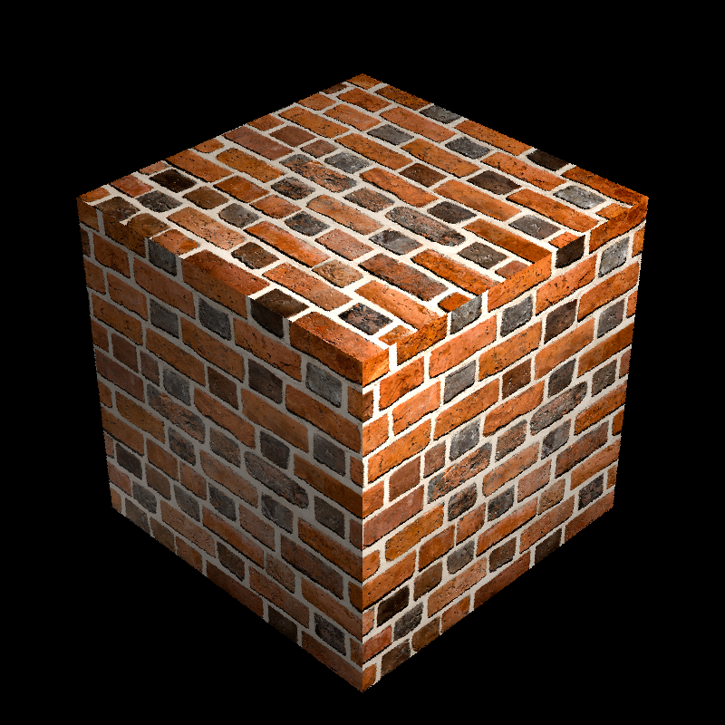

In the following scenes, I get too noisy outputs at first.

Sphere Nearest Bilinear
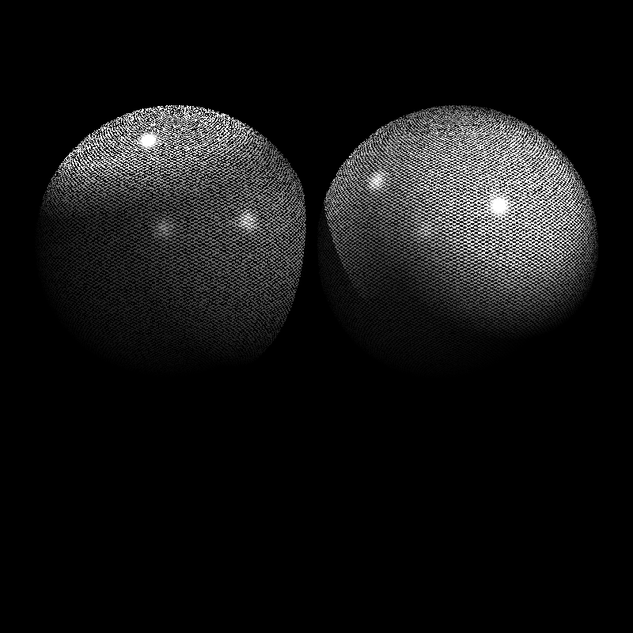

Plane Nearest
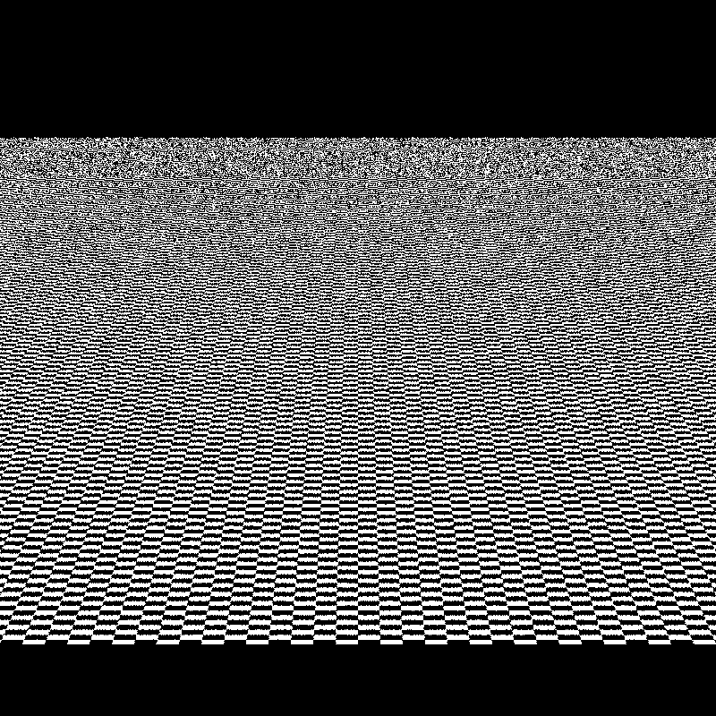

Plane Bilinear
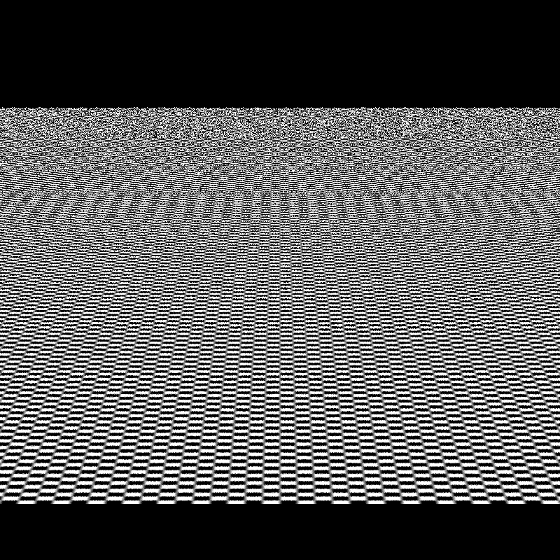

However, expected scenes are not that noisy, instead they have aliasing artifacts, and the num_samples are 1. Then, I realized for 1 sample, they were probably rendered with middle of the pixel sample. Then, I edited my sampling code to return 0.5, 0.5 if the num_samples = 1.

Sphere Nearest Bilinear
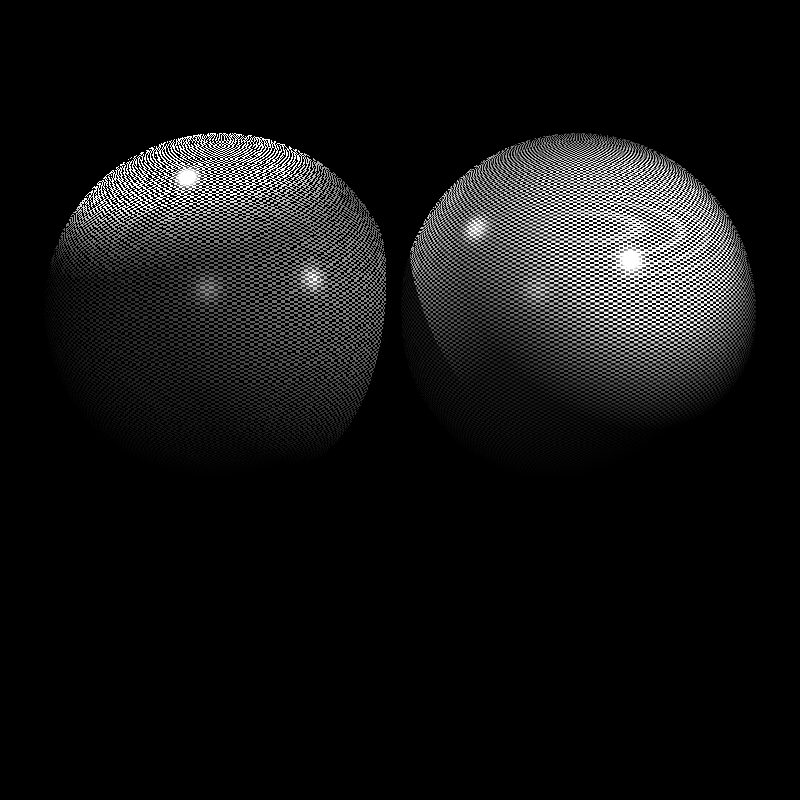

Plane Nearest
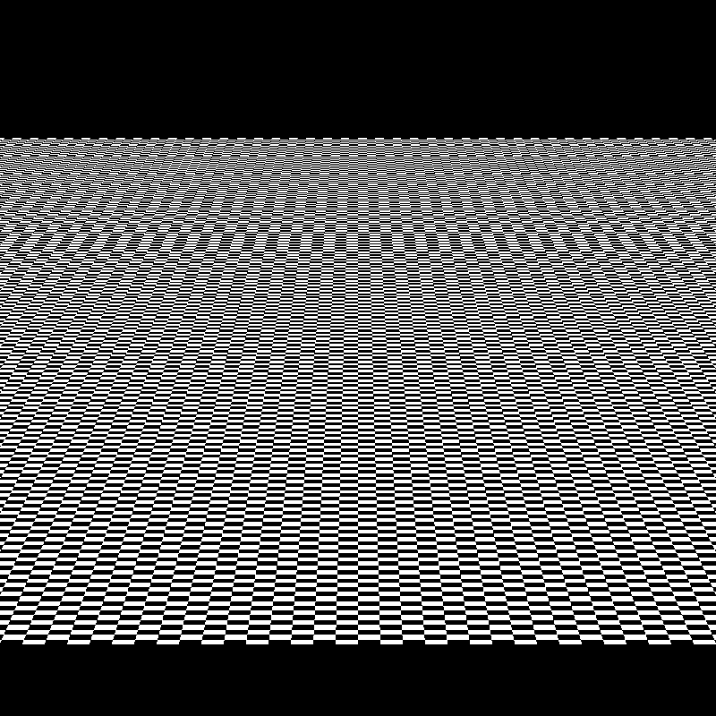

Plane Bilinear
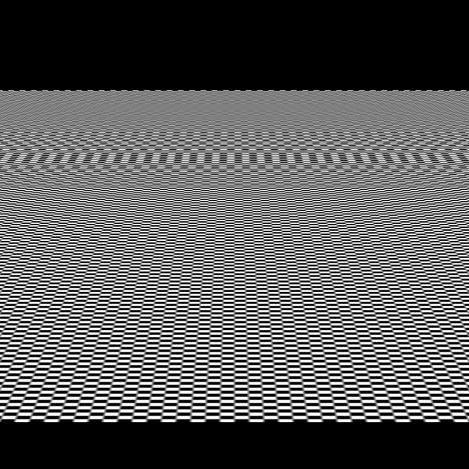

## Normal Mapping
I precalculated the Triangle surface tangent vectors and stored them. For spheres, it was on the fly. Then in the hit functions, I pass these values to the hitRecord.

```cpp
// Triangle
auto v1_0 = v1 - v0;
auto v2_0 = v2 - v0;
auto a = tex_coords.uvs[1].x - tex_coords.uvs[0].x;
auto b = tex_coords.uvs[1].y - tex_coords.uvs[0].y;
auto c = tex_coords.uvs[2].x - tex_coords.uvs[0].x;
auto d = tex_coords.uvs[2].y - tex_coords.uvs[0].y;
float inv_det = 1 / (a * d - b * c);

this->u = inv_det * (d * v1_0 - b * v2_0);
this->v = inv_det * (-c * v1_0 + a * v2_0);
```

```cpp
// Sphere
if (texture)
{
		float u, v;
		getSphereUV(rec.point, u, v);
		rec.uv = { u, v };

		glm::vec3 T, B;

		float pi = glm::pi<float>();
		float phi = -2.f * u * pi + pi;
		float theta = v * pi;
		glm::vec3 P_C = hitPoint - center;

		T = { 2.0f * pi * P_C.z, 0.0f, -2.0f * pi * P_C.x };
		B = { pi * P_C.y * glm::cos(phi), -pi * radius * glm::sin(theta), pi * P_C.y * glm::sin(phi) };

		T = glm::normalize(T);
		B = glm::normalize(B);
		rec.tangent_u = T;
		rec.tangent_v = B;
}
```
Brickwall with Normalmap
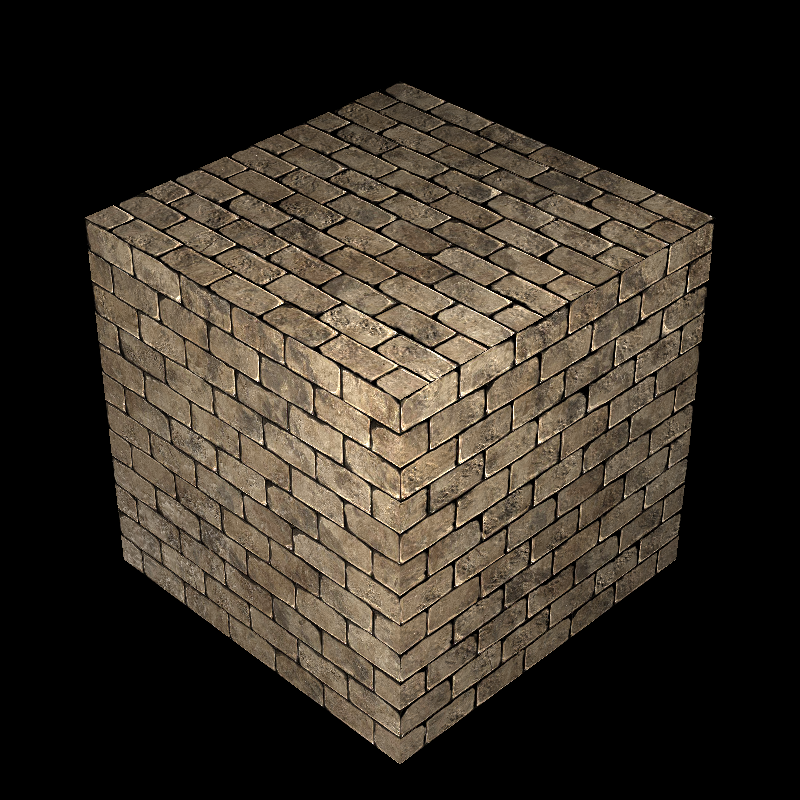

Cube Cushion
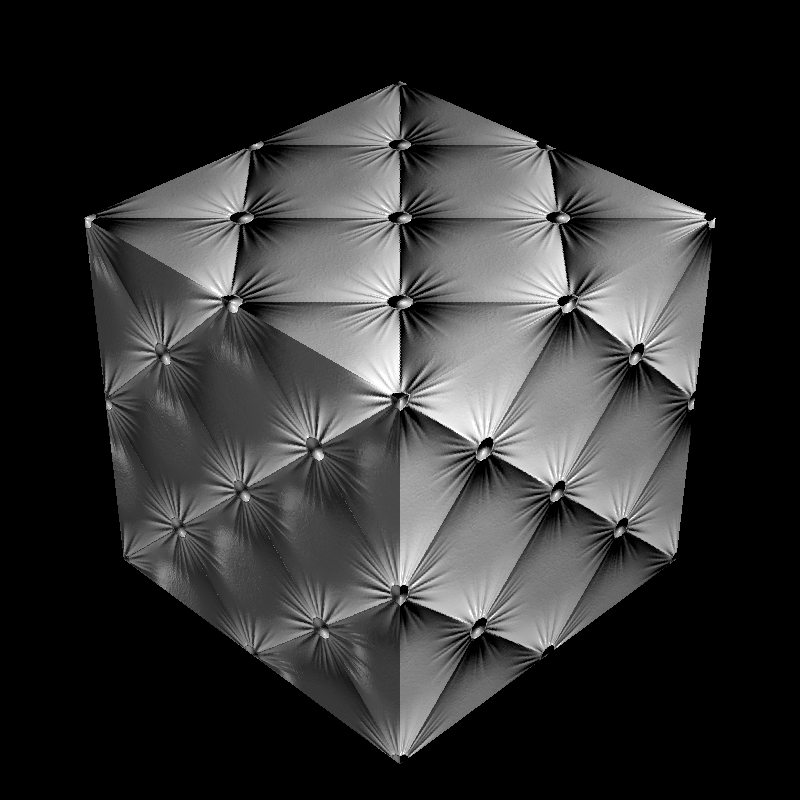

Cube Wall Normal
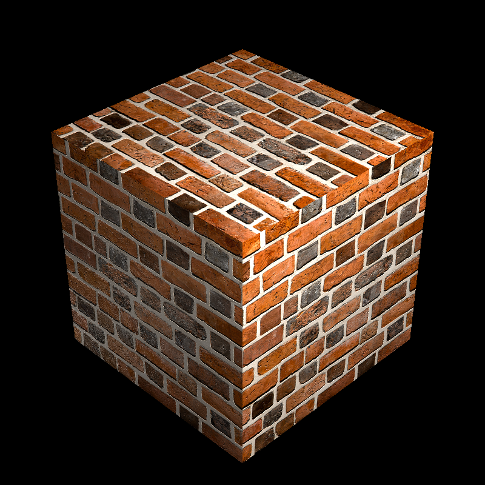

Cube Waves
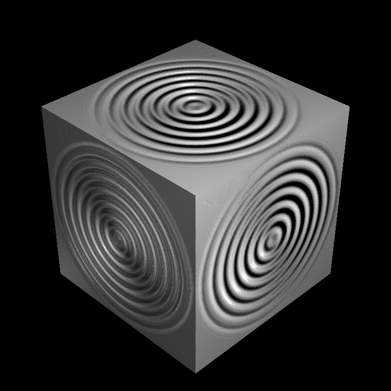

Sphere Normal
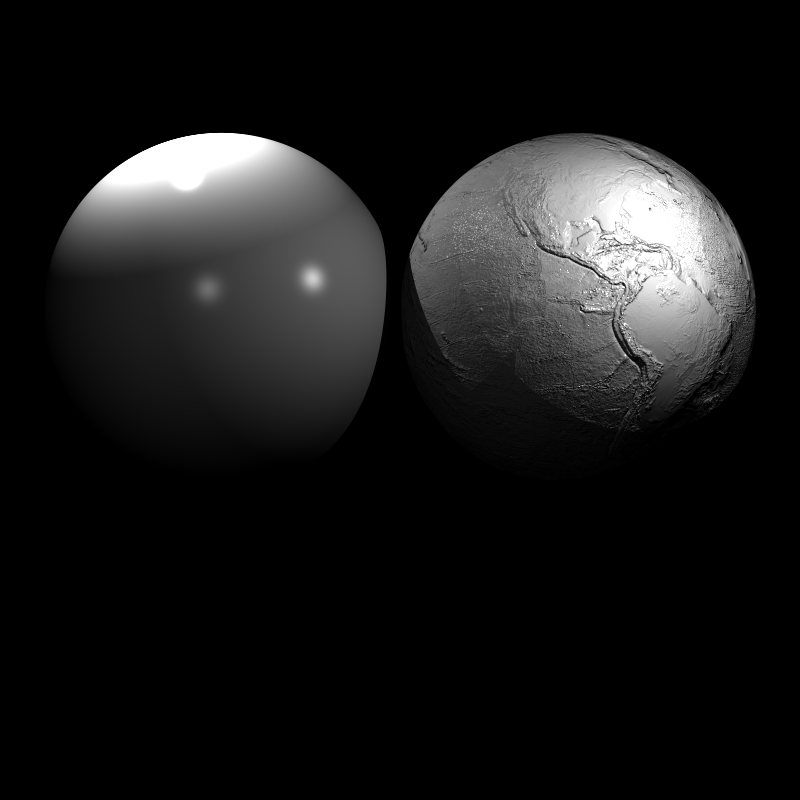

## Perlin Noise
To implement perlin noise, I defined a small header for helper functions (Thank God I didn't write another class).

```cpp
static void initPerlin()
{
  static thread_local std::mt19937 g(std::random_device{}());
  std::shuffle(std::begin(table), std::end(table), g);
}


inline glm::vec3 getGradient(int i, int j, int k)
{
  int idx;
  idx = table[abs(k) % 16];
  idx = table[abs(j + idx) % 16];
  idx = table[abs(i + idx) % 16];
  return gradients[idx];
}

inline float interpolation_function(float x)
{
	float abs_x = std::abs(x);
	if (abs_x >= 1)
		return 0.0f;

	return -6.0f * abs_x * abs_x * abs_x * abs_x * abs_x
		+ 15.0f * abs_x * abs_x * abs_x * abs_x
		- 10 * abs_x * abs_x * abs_x
		+ 1.0f;
}

inline float calculate_c(int i, int j, int k, const glm::vec3& p)
{
  float dx = p.x - i;
  float dy = p.y - j;
  float dz = p.z - k;

  glm::vec3 d = glm::vec3(dx, dy, dz);
  glm::vec3 g = getGradient(i, j, k);

  float c = interpolation_function(dx) * interpolation_function(dy) * interpolation_function(dz) * glm::dot(g, d);
  return c;
}

inline float perlinNoise(const glm::vec3& point,
                         float noise_scale,
                         std::string noise_conversion,
                         int num_octaves)
{
  float s = 0.0f;
  const auto p = point * noise_scale;
  for (int l = 0; l < num_octaves; l++)
  {
    float pow2_l = std::pow(2, l);
    float inv_pow2_l = 1.0f / pow2_l;
    const auto scaled_p = p * pow2_l;

    int i, j, k;
    i = floor(scaled_p.x);
    j = floor(scaled_p.y);
    k = floor(scaled_p.z);

    float c = 0.0f;
    for (int di = 0; di <= 1; ++di)
    {
      for (int dj = 0; dj <= 1; ++dj)
      {
        for (int dk = 0; dk <= 1; ++dk)
        {
          int x = i + di;
          int y = j + dj;
          int z = k + dk;
          c += calculate_c(x, y, z, p);
        }
      }
    }  
    s += c * inv_pow2_l;
  }

  if (noise_conversion == "linear")
    s = (s + 1) / 2.0f;
  else
    s = std::abs(s);

  return s;
}
```

Cube Perlin
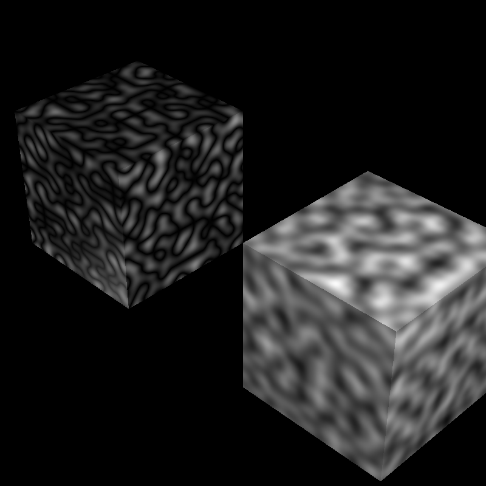

For the dragon new, I didn't succeed to get the desired effect for octaves. I changed the octaves, and it effected the result but it wasn't as good as the expected output, don't know why.

Dragon New
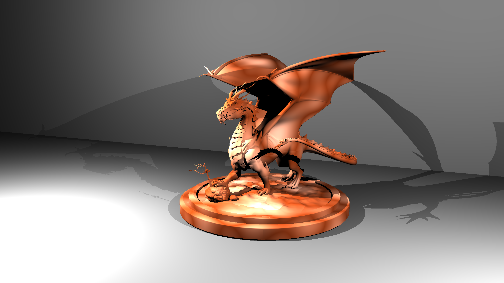

Ellipsoids Texture
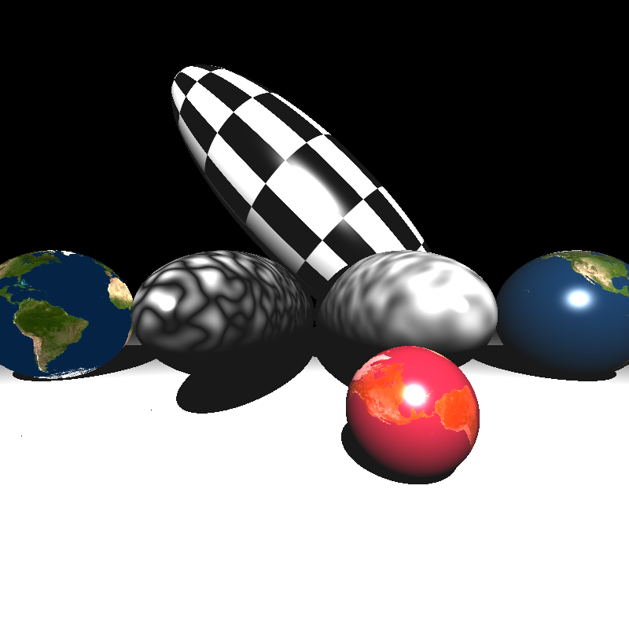

Sphere Perlin


Sphere Pelin Scale
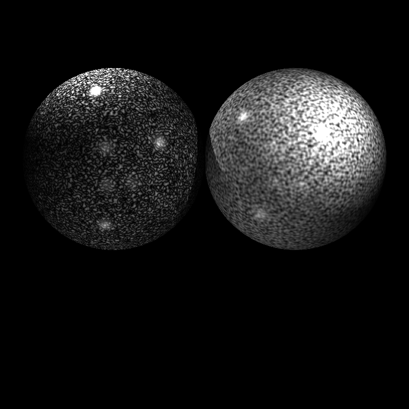

## Bump Mapping

For bump mapping, the changes are in the code snippets I provided above (In TextureFetcher and gigantic switch case). The definitions:

```cpp
float TextureFetcher::height_helper(const ImageData& img, glm::vec2 tex_coord, Interpolation interp) const
{
	auto tex_val = getTextureValue(
		img.data,
		img.width,
		img.height,
		img.channels,
		tex_coord.x,
		tex_coord.y,
		interp
	);
	auto res = (tex_val.x + tex_val.y + tex_val.z) / 3.0f;
	return res / 255.0f;
}

float TextureFetcher::height_function(glm::vec2 tex_coord, int texture_id, FetchMode mode) const
{
	const TextureMap& tex = data_.textures[texture_id];
	const TextureType type = tex.type;
	Interpolation interp = tex.interp;
	float res = 0;
	glm::vec3 tex_val;
	switch (type)
	{
		case TextureType::image:
		{
			const ImageData& img = image_datas_.at(tex.image_id);
			float h_value = height_helper(img, tex_coord, interp);
			if (mode == FetchMode::value_u_v)
			{
				res = h_value;
			}
			else if (mode == FetchMode::derivative_u)
			{
				float delta_u = 1.0f / img.width;
				tex_coord.x += delta_u;
				//tex_coord.x = std::min(tex_coord.x, 1.0f);
				float h_udeltau = height_helper(img, tex_coord, interp);
				res = (h_udeltau - h_value);
			}
			else if (mode == FetchMode::derivative_v)
			{
				float delta_v = 1.0f / img.height;
				tex_coord.y += delta_v;
				//tex_coord.y = std::min(tex_coord.y, 1.0f);
				float h_vdeltav = height_helper(img, tex_coord, interp);
				res = (h_vdeltav - h_value);
			}			
			break;
		}
		default:
			break;
	}
	res *= tex.bump_factor;
	return res;
}
```

Bump Mapping Transformed
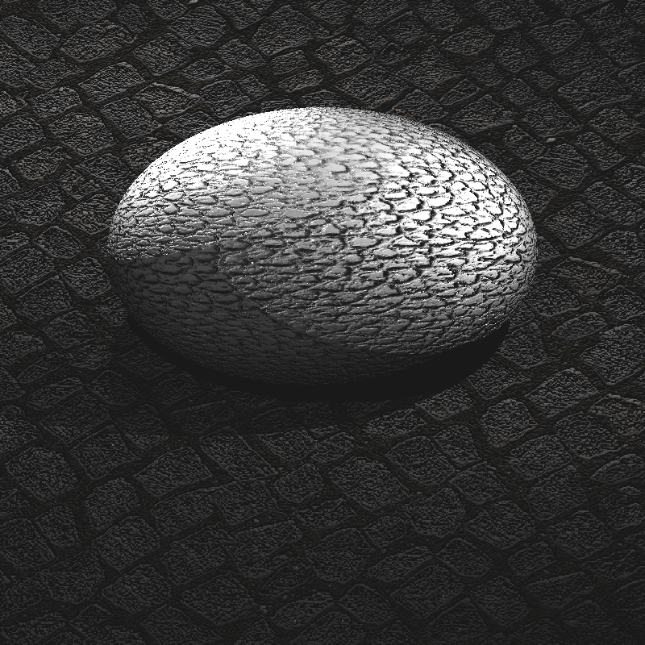

Cube Perlin Bump
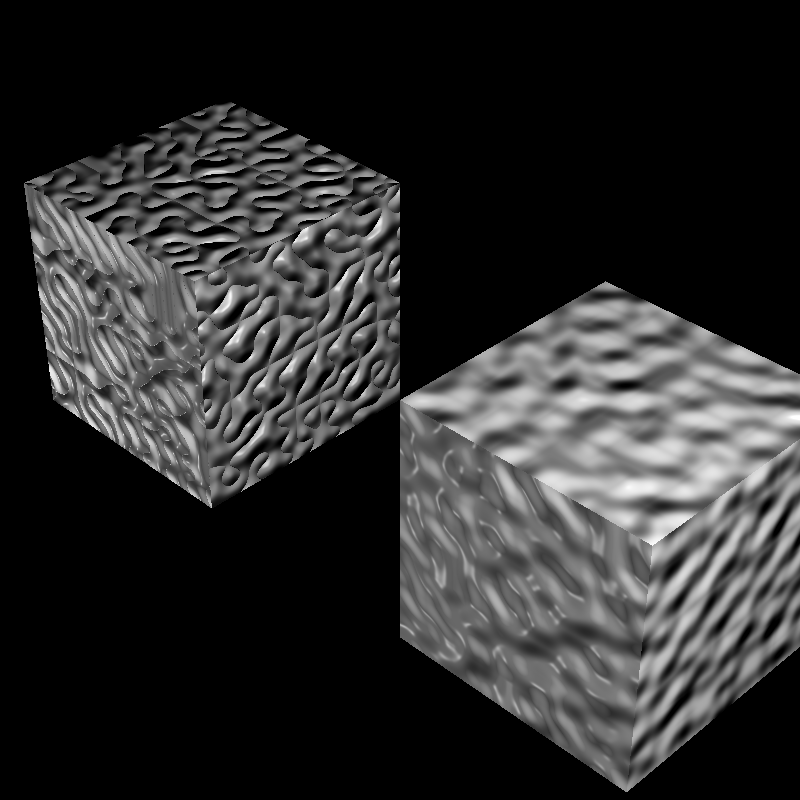

Galactica Static
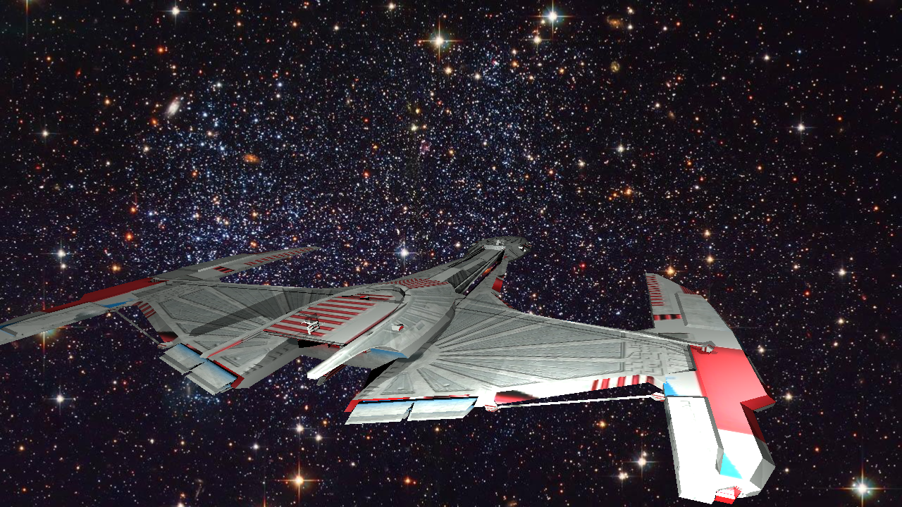

Galactica Dynamic
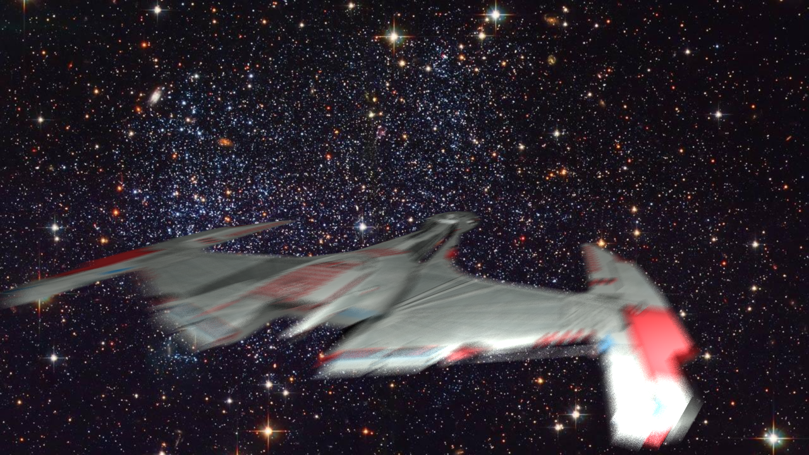

For killeroo I didn't get as bumpy as in the expected with the given BumpFactor = 0.1

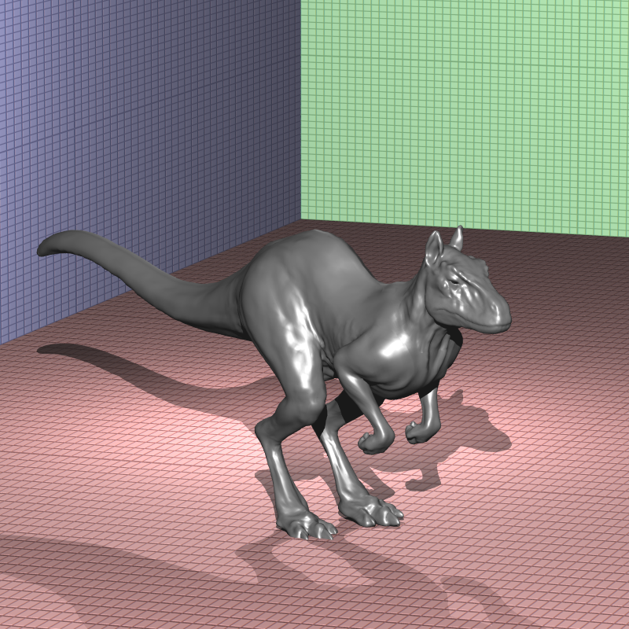

I edited it to be 10, and get something much closer.

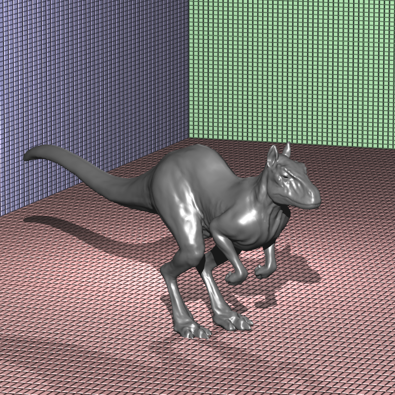

For sphere_nobump_bump, as no BumpFactor is given, I got a too flat surface. I edited the input and gave 12.

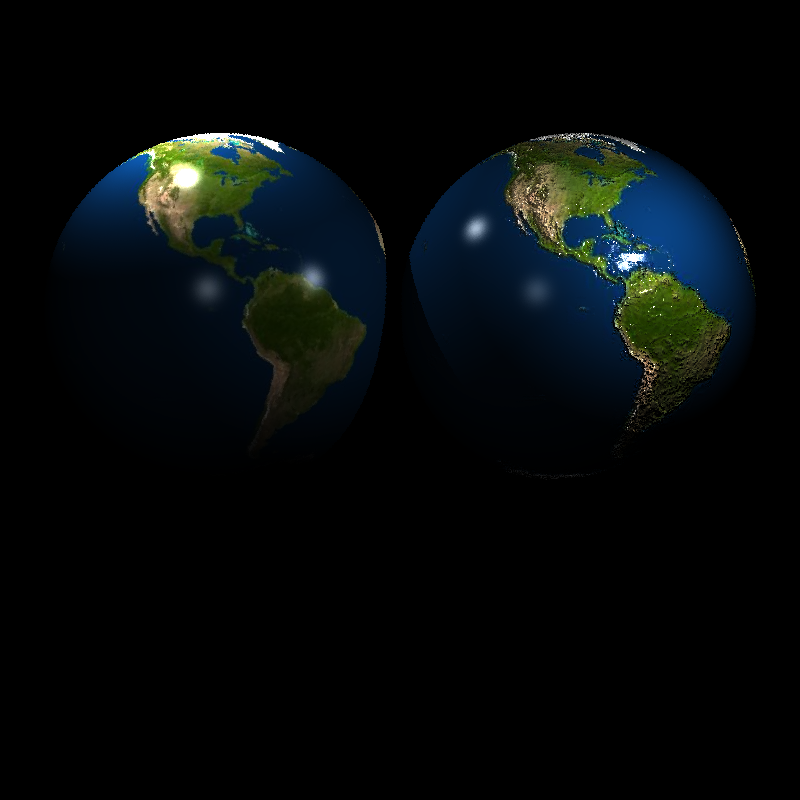

Also, for sphere_nobump_justbump, I gave BumpFactor = 10 to get desired output.

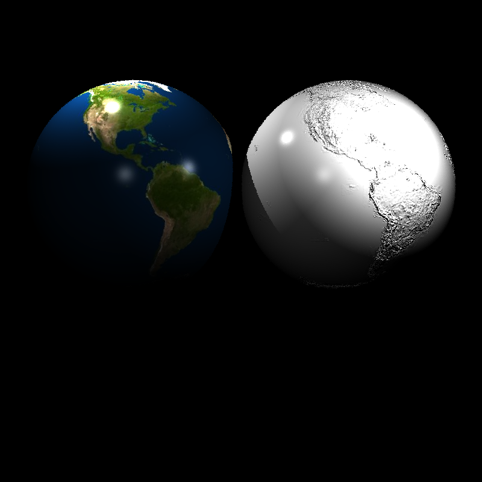

Also, for sphere_perlin_bump, I gave BumpFactor = 1.

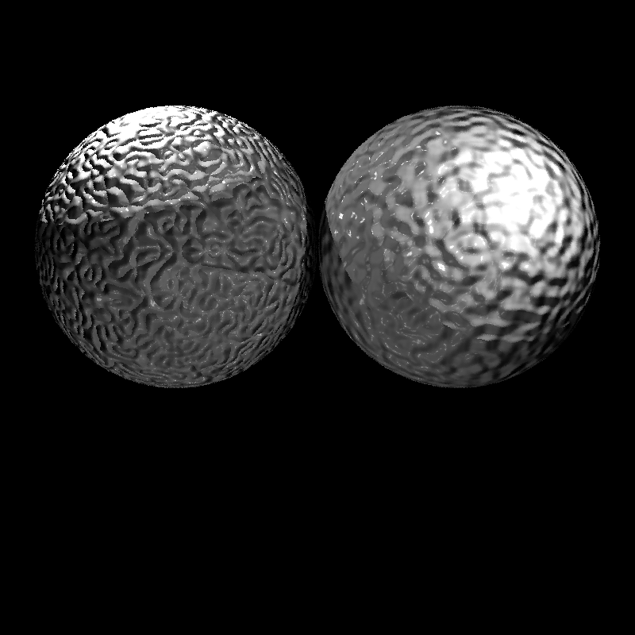

Wood Box All
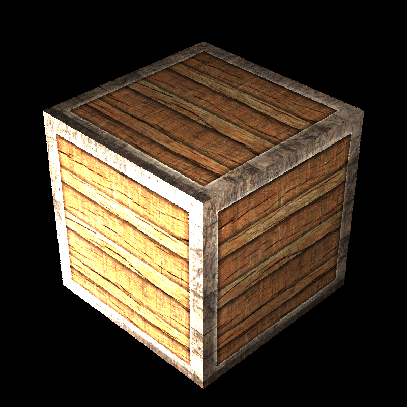

## Veach Ajar
Veach Ajar input file's mesh instance id's are not defined as they are in the previous' phase. Mesh's and MeshInstance's share the same id space. In the Veach Ajar MeshInstance's ids starts from 1 again. (In my parser there is a check that whether there is a duplicate mesh id). Funn part is, even after rewriting id's I got plain black output, couldn't fix.

## Tunnel of Doom
While I was writing this blogpost I realized I didn't edit the planes for texture mapping. 

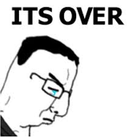

## Mytap
I didn't implemented the trilinear interpolation and tried to render the scene anyways. The tap is visible but as I return nothing in the trilinear case, there were no tiling, just a plain reflective surface. Then, tried to render with bilinear, but even with empty returning trilinear it took 531 seconds. I started rendering for bilinear and left my computer for hours; however, it didn't even finished the rendering. Below image is the empty trilinear.

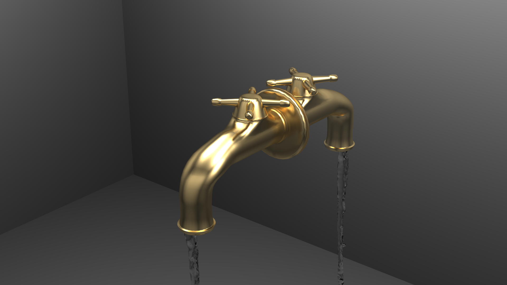

## Benchmarks

| Scene                           | Rendering Time in Seconds |
|----------------------------------|---------------------------|
| Cube Wall                        | 0.32                      |
| Sphere Nearest Bilinear          | 0.13                      |
| Plane Nearest                    | 0.10                      |
| Plane Bilinear                   | 0.13                      |
| Sphere Nearest Bilinear          | 0.11                      |
| Brickwall with Normalmap         | 0.18                      |
| Cube Cushion                     | 0.14                      |
| Cube Wall Normal                 | 0.29                      |
| Cube Waves                       | 0.17                      |
| Sphere Normal                    | 3.11                      |
| Cube Perlin                      | 0.13                      |
| Dragon New                       | 2.13                      |
| Ellipsoids Texture               | 0.15                      |
| Sphere Perlin                    | 0.16                      |
| Sphere Perlin Scale              | 0.16                      |
| Bump Mapping Transformed         | 0.27                      |
| Cube Perlin Bump                 | 0.16                      |
| Galactica Static                 | 0.52                      |
| Galactica Dynamic                | 26.8                      |
| Killeroo Bump Walls              | 4.05                      |
| Sphere Nobump Bump               | 0.14                      |
| Sphere Nobump Justbump           | 0.13                      |
| Sphere Perlin Bump               | 0.16                      |
| Wood Box All                     | 0.22                      |
| Mytap							   | 531					   |


