# Ray Tracer Phase 6 Blog: Path Tracing

## Code Design
This one is probably one of the worst code submissions I have done so far as too little time were left after all other finals and homeworks so I had to be fast in order to deliver a working baseline pathtracer at least with no extre features. I also managed to implement importance sampling, splitting and Russian roulette as well. The overall changes are: Copying the whole raytracer rendering loop, pasting to other source file named pathtracer and changing the necessary parts, removing the unnecessary parts etc. Huge code duplication but it was the fastest. Also, I add a BRDF struct and bury it in material to use. 

## Base Path Tracer
I decided to start with the most minimal path tracer imaginable. No NEE, no MIS, no roulette etc. Since there will be no NEE (direct light sampling), I had to implement object lights to be able to render some scenes at least. I just added a radiance parameter to the meshes and spheres. Then, add this as a field of hit record. When a hit occurs, the mesh/sphere would populate the hitRecord with their respective radiance values. In the rendering loop, I just check that, this `std::optional` radiance has a value, if thats the case accumulate it. Aside from the internal equations to code mapping done in the BRDF, the path tracing loop itself was quite trivial compared to the ray tracer. We just need to sample a random direction and update the throughput with PDF. Without NEE, some might even say writing a path tracer is easier than a ray tracer. 

## Importance Sampling
This is one of the things we did in the previous phase so it was not a big problem at all. The parsing and accessing the renderer parameters was the real problem. I pass the renderer parameters in `CameraContext` struct and check which options are enabled and choose my sampling pattern according to it.

```cpp
if (cam_context.options.at(RendererParams::ImportanceSampling))
{
	r = std::sqrt(r1);
	x = r * std::cos(theta);
	y = r * std::sin(theta);
	z = std::sqrt(std::max(0.0f, 1.0f - r1));
	next_dir = glm::normalize(x * u + y * v + z * w);

	invPDF_cosTheta = M_PI;
}
else
{
	z = r1;
	r = std::sqrt(std::max(0.0f, 1.0f - z * z));
	x = r * std::cos(theta);
	y = r * std::sin(theta);
	next_dir = glm::normalize(x * u + y * v + z * w);

	float cosTheta = std::max(0.0f, glm::dot(rec.normal, next_dir));
	invPDF_cosTheta = cosTheta * 2.0f * M_PI;
}
```

## BRDF
To evaluate and use BRDF, I wrote a member method for `BRDF` struct and pass the parameters like wi, wo, kd, ks, etc. to return me the total diffuse + specular brdf evaluation referring to the paper brdf in the ODTUCLASS. I couldn't get the correct image in Torrance Sparrow Killeroo, it is too light compared to the expected, and couldn't debug it as I had no time left, maybe a parsing issue that IDK.
```cpp
glm::vec3 BRDF::Evaluate(const glm::vec3& wi, const glm::vec3& wo, const glm::vec3& n,
                         const glm::vec3& kd, const glm::vec3& ks, float refraction) const
{
    float cosThetaI = std::max(0.0f, glm::dot(n, wi));

    if (cosThetaI <= 0.0f) return glm::vec3(0.0f);

    glm::vec3 diffuse(0.0f);
    glm::vec3 specular(0.0f);

    glm::vec3 wh = glm::normalize(wi + wo);
    float cosAlphaH = std::max(0.0f, glm::dot(n, wh));

    switch (type)
    {
	    case BrdfType::OriginalPhong:
	    {
	        glm::vec3 r = glm::normalize(2.0f * glm::dot(n, wi) * n - wi);
	        float cosAlphaR = std::max(0.0f, glm::dot(r, wo));

	        diffuse = kd;
	        float spec_factor = std::pow(cosAlphaR, exponent);
	        if (cosThetaI > 1e-6f) spec_factor /= cosThetaI;

	        specular = ks * spec_factor;
	        break;
	    }
	    case BrdfType::ModifiedPhong:
	    {
	        glm::vec3 r = glm::normalize(2.0f * glm::dot(n, wi) * n - wi);
	        float cosAlphaR = std::max(0.0f, glm::dot(r, wo));

	        if (normalized)
	        {
	            diffuse = kd * (float)(1.0 / M_PI);
	            float norm_factor = (exponent + 2.0f) / (2.0f * M_PI);
	            specular = ks * (norm_factor * std::pow(cosAlphaR, exponent));
	        }
	    	else
	    	{
	            diffuse = kd;
	            specular = ks * std::pow(cosAlphaR, exponent);
	        }
	        break;
	    }
	    case BrdfType::OriginalBlinnPhong:
	    {
	        diffuse = kd;
	        float spec_factor = std::pow(cosAlphaH, exponent);
	        if (cosThetaI > 1e-6f) spec_factor /= cosThetaI;

	        specular = ks * spec_factor;
	        break;
	    }
	    case BrdfType::ModifiedBlinnPhong:
	    {
	        if (normalized)
	        {
	            diffuse = kd * (float)(1.0 / M_PI);
	            float norm_factor = (exponent + 8.0f) / (8.0f * M_PI);
	            specular = ks * (norm_factor * std::pow(cosAlphaH, exponent));
	        }
	    	else
	    	{
	            diffuse = kd;
	            specular = ks * std::pow(cosAlphaH, exponent);
	        }
	        break;
	    }
	    case BrdfType::TorranceSparrow:
	    {
    		float D = ((exponent + 2.0f) / (2.0f * M_PI)) * std::pow(cosAlphaH, exponent);
    		float cosBeta = std::max(0.0f, glm::dot(wi, wh));
    		float r0_val = std::pow(refraction - 1.0f, 2.0f) / std::pow(refraction + 1.0f, 2.0f);

    		glm::vec3 R0 = ks * r0_val;
    		glm::vec3 F = R0 + (glm::vec3(1.0f) - R0) * std::pow(1.0f - cosBeta, 5.0f);

    		float NdotWh = cosAlphaH;
    		float NdotWo = std::max(0.0f, glm::dot(n, wo));
    		float NdotWi = cosThetaI;
    		float WoDotWh = std::max(1e-6f, glm::dot(wo, wh));

    		float G = std::min(1.0f, std::min((2.0f * NdotWh * NdotWo) / WoDotWh,
											 (2.0f * NdotWh * NdotWi) / WoDotWh));

    		if (NdotWo > 1e-6f && NdotWi > 1e-6f)
    		{
    			specular = (D * G * F) / (4.0f * NdotWo * NdotWi);
    		}
    		else
    		{
    			specular = glm::vec3(0.0f);
    		}

    		diffuse = kd * (float)(1.0 / M_PI);

    		if (kdfresnel)
    		{
    			diffuse *= (glm::vec3(1.0f) - F);
    		}
    		break;
	    }
    }

    return diffuse + specular;
}
```
## Splitting
In path tracer, I went with iterative way instead of recursive. Without splitting, the code was very simple as we won't have two rays to trace as in the ray tracer for dielectrics. Everytime it is just one ray, and I can loop for it with just one for loop. When implementing splitting, I had to use a stack and while loop. In the stack I held path state with ray, depth, and throughput. 
```cpp
int num_splits = 1;
if (state.depth == 0 && cam_context.splitting_factor > 1)
{
	num_splits = cam_context.splitting_factor;
}
```
When it is not the primary ray, I for loop for splitting the ray and push them to the stack.
```cpp
if (num_splits > 1)
{
	next_throughput = next_throughput / num_splits;
}

if (next_throughput.r > 1e-5 || next_throughput.g > 1e-5 || next_throughput.b > 1e-5)
{
	stack.push_back({next_ray, next_throughput, state.depth + 1});
}
```
Also, you can see the little optimization trick above. If the throughput is too low, I just don't continue with that path as the contribution becomes negligible and calculating further won't do any good for us. 

## Russian Roulette
Implementing Russian roulette was as simple as splitting. That's the reason I started to implement extra features with them, they were the easiest ones and I beleieved that I can finish them before the deadline while also working on the term project. 
```cpp
if (russian_roulette && state.depth >= cam_context.min_recursion_depth)
{
	survival_rate = std::clamp(throughput.max(), 1e-7, 0.99);

	float bullet_to_the_head = generateRandomFloat(0, 1);
	if (bullet_to_the_head > survival_rate)
		continue;

	throughput *= 1.0f / survival_rate;
}
```

## Resulting Images
You will notices that I couldn't put some of the scenes' outputs as I know that I am unable to render some of them. NEE included scenes are the majority of them. Also, since I rushed to implement the path tracing, I couldn't support some features in ray tracing such as object lights. They are only supported by path tracer only for now thanks to the technical debt (GOD I LOVE IT). All scenes have the Russian Roulette after the NEE, so I cannot be sure about the splitting and RR's correctness, but I edited the scenes to have Importance Russian Roulette alone to test.


Killeroo Blinn Phong
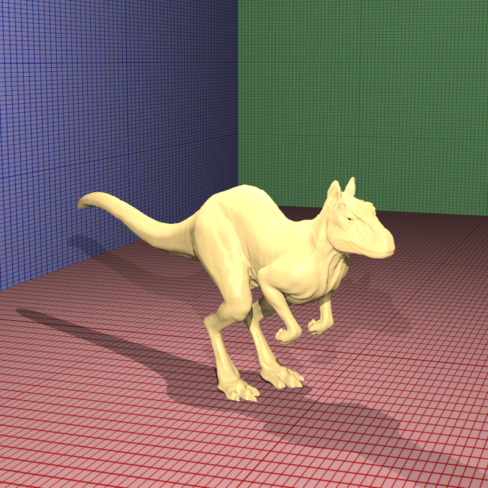
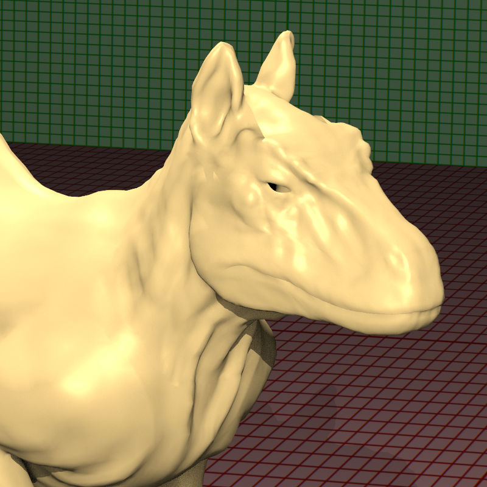

Killeroo Torrance Sparrow
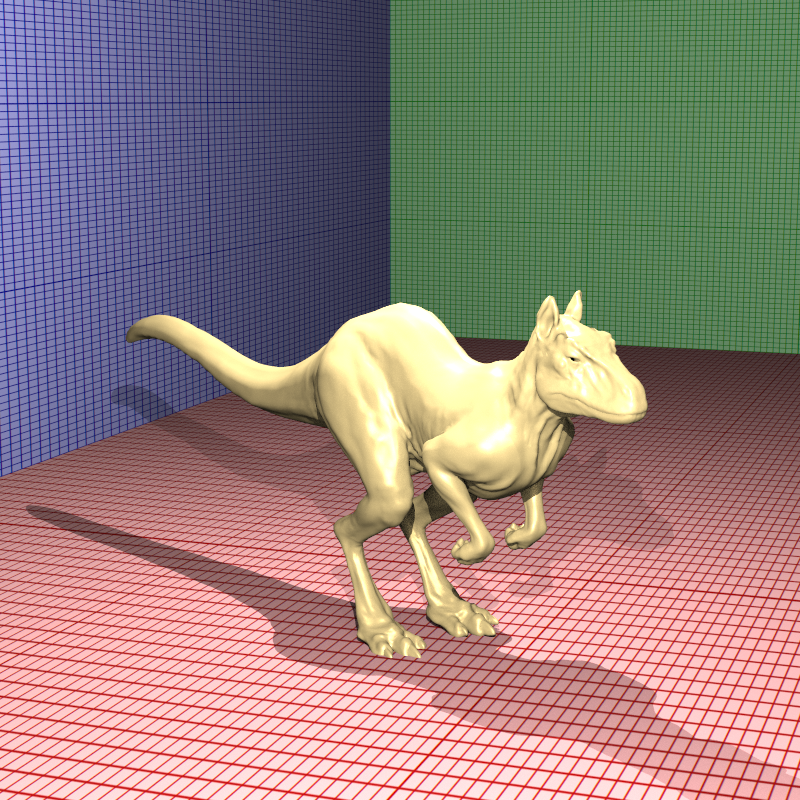
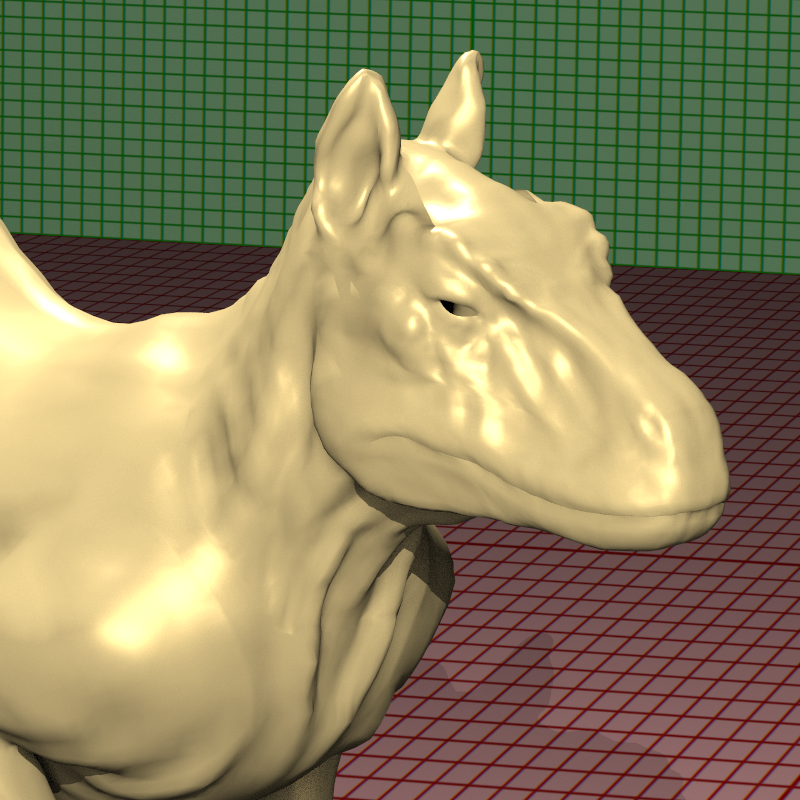

Cornellbox Jaroslav Diffuse
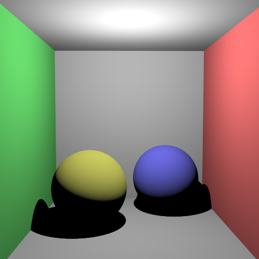


Cornellbox Jaroslav Glossy
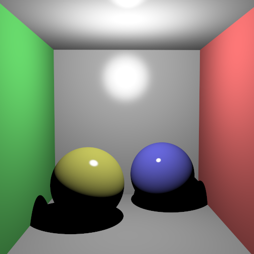

Cornell Diffuse Default
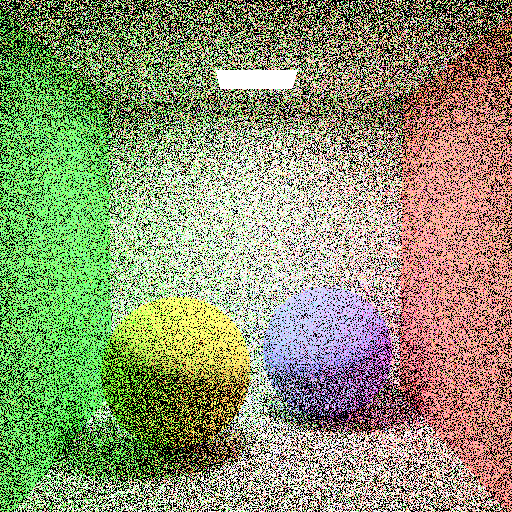

Cornell Diffuse Importance
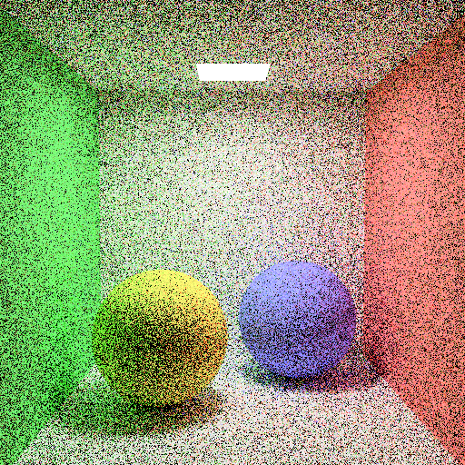

Cornell Diffuse Importance Russian Roulette with Splitting = 4, Samples=225, MinRecursion=4
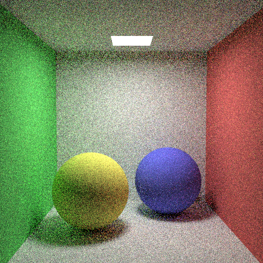

Cornell Glass Mirror Default
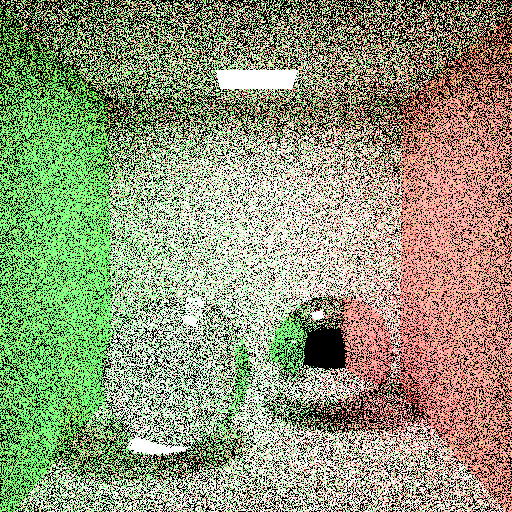

Cornell Glass Mirror Importance
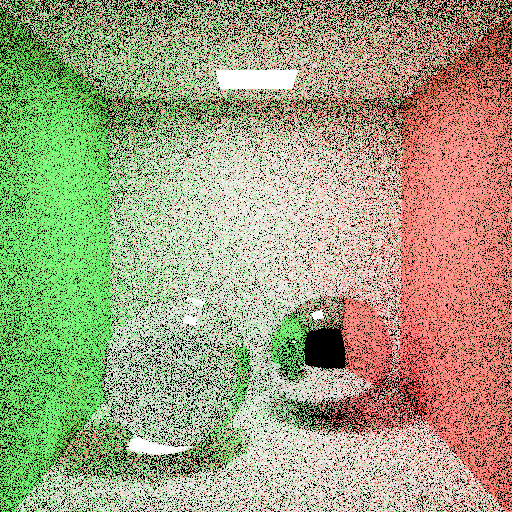

Cornell Glass Mirror Importance Russian Roulette with Splitting = 4, Samples=225, MinRecursion=4
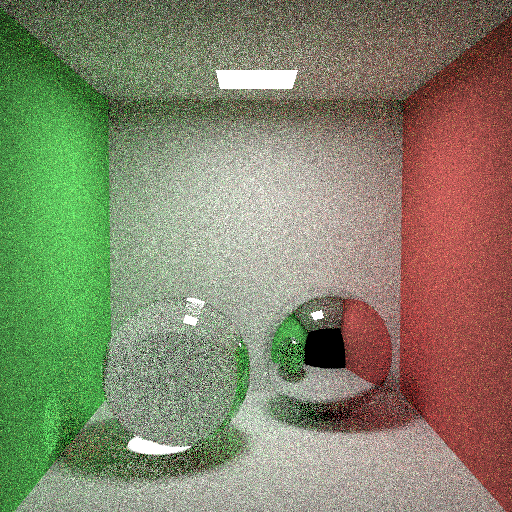

Cornell Prism Light
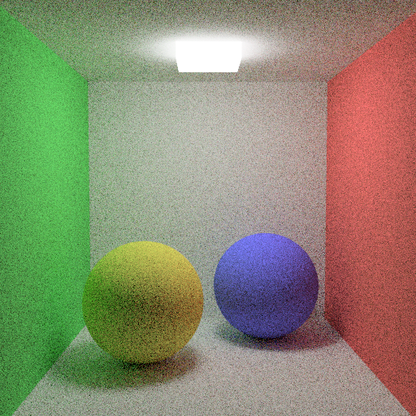

Cornell Sphere Light
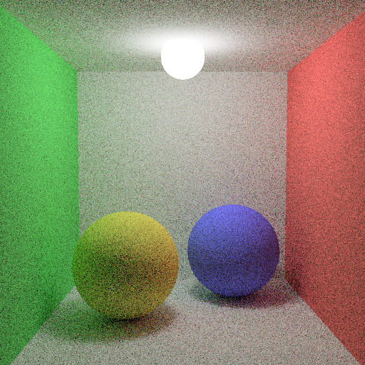

## SSS Dragon
This scene is created by Akın to test SSS feature for our term project. I changed and tuned the material and light numbers to get a nice looking image. Here is the path traced, no-SSS, Importance Sampling, Russian Roulette, Splitting=4, MinRecursion=4, 900 samples Red Dragon (Hannibal reference). 

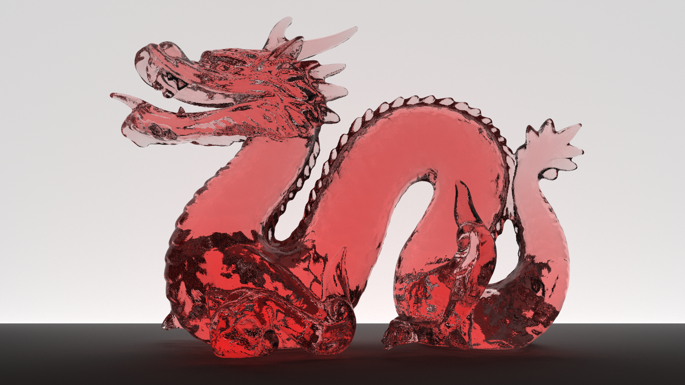


